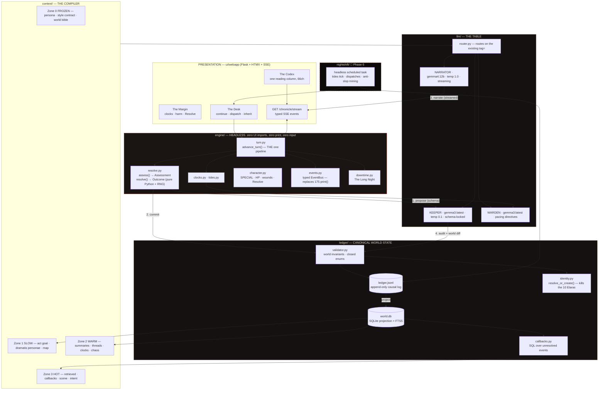

# RP_GPT → **THE ASHFALL CODEX**
### Master Engineering & Design Plan
*Compiled 2026-07-28 from four subsystem analyses, two research briefs, three verified defect reports, and four design visions.*

---

## Table of Contents

1. [Where This Project Actually Stands](#1-where-this-project-actually-stands)
2. [The Vision](#2-the-vision)
3. [Architecture Target](#3-architecture-target)
4. [The Model Stack](#4-the-model-stack)
5. [Mechanics: Fix / Improve / Replace / Add](#5-mechanics-fix--improve--replace--add)
6. [Visual & Experience Design](#6-visual--experience-design)
7. [The Roadmap](#7-the-roadmap)
8. [Verified Bug List](#8-verified-bug-list)
9. [Risks and Open Questions](#9-risks-and-open-questions)

---

# 1. Where This Project Actually Stands

## 1.1 The headline

**The game does not run.** `python RP_GPT.py` — the documented entry point — crashes before drawing a pixel. `RUN_INTERFACE = "ui"` (`RP_GPT.py:266`) routes to `Core/Main_Menu.py:14`, which imports pygame. The project venv is Python 3.14.0 (`.venv/pyvenv.cfg`) and the installed pygame 2.6.1 ships only `cp311` binaries. Verified this session:

```
.venv/Scripts/python.exe -c "import pygame"
→ ModuleNotFoundError: No module named 'pygame.base'
```

That kills 6 of 19 `Core/` modules — **7,452 of 12,801 Python lines, 58% of the codebase.** The Flask/HTMX web UI is the only stack that boots.

**And the game is unwinnable even when it runs.** `calc_dc` (`RP_GPT.py:440`) is:

```python
base + state.act.index + state.scene_phase + state.stall_count + (state.pressure // 25)
```

`scene_phase` increments on every **success** (`Core/Scene_Evolution.py:166`) and only resets at an act boundary. `end_of_turn` (`Core/Turn_And_Act_Flow.py:189`) adds `2 + act.index` pressure **every turn, passively**, toward a loss condition at 100 that nothing meaningfully reduces. A faithful 4,000-run simulation of this exact math: at the character-creation default SPECIAL of 5, Act 1 completes **2.0%** of the time and the player dies to pressure **29%** of the time. At the budget average of 7: **10.3% / 15%**. Across 5,000 full campaigns: **0% wins.**

The difficulty ratchet punishes competence. This is not a tuning problem.

## 1.2 What is genuinely good — build on this

These are real assets, and the plan preserves every one of them.

**The state model is already headless.** `RP_GPT.py:290–427` is pure dataclasses — `Stats`, `Buff`, `Item`, `Actor`, `Player`, `ActPlan`, `CampaignBlueprint`, `ActState`, `ImageEvent`, `GameState` — with zero UI imports. Extracting an engine package does not require redesigning the data. It requires deleting `print` and `input`.

**The prompt layer is well-decomposed.** Ten prompt builders in `Core/AI_Dungeon_Master.py:305–552` are pure `GameState → str` functions, cleanly separated from their call sites, already state-conditioned on the right things (act goal, campaign goal, pressure, scene phase, previous situation with an explicit "do NOT repeat verbatim" at `:544`). Swapping in a real prompt system means rewriting one file, not thirteen.

**The microplan system is the best original idea in the project.** `option_microplans_prompt` (`Core/AI_Dungeon_Master.py:456`) asks the model what STR/PER/CHA would *concretely mean right now, in this situation*, then presents those as menu options. That is a genuine innovation over "pick a verb." It just needs to also return stakes, a position, and a cost.

**`goal_lock` is narrative pacing as prompt conditioning.** `Core/Choice_Handler.py:91` flips prompt language between "tightly advance toward the act goal" and "keep to one clear beat" based on turn ratio, progress, and pressure. This deserves to survive any rewrite.

**The `tag=` argument is free instrumentation.** Every single `g.text()` / `g.json()` call already carries `tag="Blueprint"`, `tag="Turn"`, `tag="ActorScan"`. That is a ready-made key for model routing, per-task sampling, latency metrics, and player-facing status text. Zero new plumbing required.

**`download_image` is genuinely well-built defensive networking.** `Core/Image_Gen.py:291–347`: content-type check, PNG/JPEG magic-byte validation, minimum-size floor, jittered exponential backoff, degraded-prompt fallback. Keep this verbatim when the backend is swapped — it will correctly reject a ComfyUI error payload too.

**The atmospheric layer is real craft.** `Core/UI_Helpers.py:433` (`FogController`, two-layer parallax with an alpha breathing envelope), `:618` (`FlickerEnvelope`, tau-up/tau-down smoothed noise), `:547` (`CandleFlicker`, real radial falloff). And `Core/Main_Menu.py:109–237` (`play_cutscene`) is 130 lines of actual directing — timed beats at 0.0/1.2/2.1/2.4/3.6/8.8/10.5s, `ease_out_cubic`, animated letterbox, logo drift with additive glow pulse, typewriter subtitle, white flare, skip key. Both are portable as specs.

**The hand-made art is high quality and correctly authored.** 9-slice atlases at power-of-two sizes — exactly what CSS `border-image` consumes. `ui/webapp/static/app.css:253–356`'s "ninebox" trick (nine absolutely-positioned divs each showing one ninth of a texture via `background-size: 300% 300%`) is the most technically interesting CSS in the project, and it correctly sidesteps `border-image`'s inability to independently scale corners.

**`ui/webapp/` is architecturally correct in outline.** App-factory Flask with a dependency-injected `SessionStore` (`server.py:298`), `GameSession` owning state + a lock, route-level data loading that fails soft rather than 500ing (`_load_world_from_path` at `server.py:67`). Server-rendered Jinja + HTMX is the right bet for this project: no build step, no client state duplication, engine stays authoritative in Python.

**62% type-hint coverage** (278/448 functions, including returns) and **zero bare `except:`** clauses repo-wide. Unusually disciplined for a solo project — mypy can be switched on for real value rather than drowning.

**The Aethelgard lore bible** (`Worlds/Grimdark_fantasy/world.json`) is legitimately good generated text: a named cataclysm (the Sundering), three factions with opposed goals, three open mysteries, and a stated tonal counterweight. Its structure — Tone / Factions / Key Mysteries / Hope — is a de facto schema worth formalizing.

## 1.3 What is broken

### The turn loop exists four times, and each copy is missing different features

| Copy | Location | Missing |
|---|---|---|
| Terminal (canonical) | `Core/Turn_And_Act_Flow.py:339–364` | — |
| Dead fossil | `RP_GPT.py:649–674` | zero callers; shadows nothing; misleads every reader |
| pygame | `Core/User_Interface.py:2420–2438` | `handle_post_turn_beat`, `maybe_journal_lore`, `celebrate_break`, `camp_interlude` |
| Web | `ui/webapp/game_service.py:275–281` | `handle_post_turn_beat`, `celebrate_break`, `camp_interlude` |

Consequence: **random encounters (192 lines) and camp interludes (178 lines) never fire in either shipped UI.** `handle_post_turn_beat` is the *only* code that discovers actors, spawns enemies, generates companion asides, and sets `TurnMode.COMBAT` — and it is called from exactly one place, the terminal loop. In the web UI, `TurnMode` can literally never leave `EXPLORE`, which makes the guard at `game_service.py:218` dead code protecting against an unreachable state.

`begin_act` also exists twice — `RP_GPT.py:583` shadows the import from `Core/Turn_And_Act_Flow.py:64`. Only the `RP_GPT` copy honours `turns_per_act_override` (`:590–591`), so **the world's configured turns-per-act applies to Act 1 and silently reverts to `random.randint(8,13)` for Acts 2+.** In the web UI it never applies at all. `combat_turn` exists twice with different math (12 vs 15 goal progress on a kill). Player creation exists four times. The starting inventory is hardcoded four times.

### Half the shipped subsystems crash on first use

- **`[6] Talk` is broken in all three UIs.** `Core/Interactions.py:46–58` imports `describe_actor_physical` from `RP_GPT`, but `RP_GPT.py:171–181` omits it from its `Image_Gen` re-export block. `ImportError` at the top of `talk_loop`. "Conversation First" is a headline feature in the `RP_GPT.py:102` docstring and it does not run.
- **Every pygame combat branch crashes.** `Core/User_Interface.py:1753` calls `core.remove_if_dead`, `:1756` and five other lines call `core.enemy_attack` — neither is re-exported by `RP_GPT.py`. `hasattr(core,'enemy_attack') → False`, verified.
- **pygame combat `[5] Observe` raises `TypeError`.** `Core/User_Interface.py:1807` passes two args to `combat_observe_prompt(state, enemy, goal_lock)`.
- **The pygame world backdrop has never existed.** `Core/User_Interface.py:151` points at `Assets/UI/World_Backdrop.png`; the folder contains only `World_Backdrop1.png` and `World_Backdrop3.png`. Verified. `load_image` swallows the failure and the entire game renders on black. The correct file exists at `ui/webapp/static/ui/World_Backdrop.png` and was simply never copied back.
- **The web play loop accepts exactly one click.** `play.html:5` defines `#log-panel`; every action form in `turn_panel.html` posts with `hx-swap="outerHTML"` targeting it; the response partial's root div carries no `id`. Second click → `htmx:targetError`, no POST, no error the player can see, game over.
- **Reaching the final act with an unfinished goal hangs the server forever.** `recap_and_transition` → `last_chance` (`Core/Turn_And_Act_Flow.py:294–308`) is `while True: input()`. Under `intercepted_io` the patched `input` returns `""` unconditionally, matching no branch. Infinite loop, unbounded `StringIO` growth, single-threaded WSGI — the pywebview window freezes dead on the single most likely ending path.

### Nothing is saved, ever

Grep across `Core/`, `RP_GPT.py`, `ui/`, `desktop/` for `pickle|def save_|autosave|def load_state|resume`: nothing but a pause-menu label. `GameState` is never serialized. `RP_GPT.py:108` advertises "Session lost? Resume or restart as needed." There is no resume. Closing the window, an Ollama timeout, or any unhandled exception destroys a multi-hour campaign. Every death is permadeath by omission rather than design.

### The LLM layer runs a 262K-capable model in a 4K window

`GemmaClient._run` (`Core/AI_Dungeon_Master.py:141–191`) — verified this session — POSTs `{"model", "prompt", "stream": false}` with **no `options` block at all**, or shells out to `subprocess.run([ollama, "run", model, prompt])`, which accepts no sampling or context flags whatsoever. On this machine `shutil.which("ollama")` resolves, so **the subprocess path is what actually executes**, meaning the model is structurally unconfigurable: no `num_ctx`, no `temperature`, no `format`, no `stop`, no `keep_alive`, no streaming.

Ollama's default context scales with VRAM; at 16 GB that is the 4K bucket, and Ollama **silently trims the front of an over-length prompt with no error**. The world bible and journal are prepended. They are being amputated on essentially every call.

Meanwhile a single explore turn is **~7 sequential blocking round-trips** (floor 6, ceiling 12+), all synchronous, all on the calling thread — which in pygame is the render thread (`User_Interface.py:2158` calls `make_explore_options` from inside `_draw_options`). At 12B throughput that is **12–25 seconds of a frozen, "Not Responding" window per turn**, with no spinner and no streaming.

The project's own telemetry is a scream about this: `image_events.jsonl` contains **173 `startup` events and 80 `turn` events.** Across ~173 launches, fewer than 80 turns were ever played. That is the shape of a game people quit before the second turn.

### Structured output is prompt-begged and regex-scraped

`GemmaClient.json()` (`:198–213`) does `re.search(r"\{.*\}", raw, flags=re.S)` — greedy, first `{` to last `}` — so any trailing model chatter containing a brace poisons the match. The retry loop lives in `_run`, which returns *before* parsing, so **JSON parse failures get zero retries while transient socket errors get four.** Exactly backwards.

Worse, the blueprint template is malformed by construction: `Core/AI_Dungeon_Master.py:362` and `:369` contain `"seed_actors": [{{...}}]`, which an f-string renders as a literal `[{...}]` placeholder that models routinely echo verbatim. And the prompt says "Design a coherent `{target_acts}`-act plan" while showing a hardcoded 3-act example with act-3-is-the-finale wording baked in — so a player who picks 5 acts silently gets 3, or a malformed mix.

### Content is runtime residue, committed to git

`Characters/` holds **102 NPCs, 27 Enemies, 4 Companions** (verified). Exactly 8 were written by a human. The rest are auto-registered every time the model mentions a name.

- **Ten Elaras.** `Elara`, `Elara Meadowlight`, `Elara, the Hermit`, `Elara, the Lorekeeper`, `Elara Vane`, `Elara, Village Elder`, `Elder Elara`, `Lady Elara Harrowgate`, `Sister Elara`, `Thane Elara`.
- **Twenty interchangeable Ironclad captains**, whose entire content is three adjectives from the closed set {ruthless, disciplined, duty-bound, pragmatic, ambitious, loyal to the Dominion}. Seven of them exist **twice**, under both `NPC/` and `Enemies/`, because role is a *directory* and `RP_GPT.py:510`'s `role_from_kind` substring-sniffs free text ("Dominion Soldier" contains "soldier" → enemy; "Dominion Officer" does not → npc).
- **Root cause:** `Core/Scene_Evolution.py:162` calls `scan_for_new_actor` **every single turn** against a paragraph describing the people already in the room, asks "did someone NEW arrive?", and at `:116` does `state.act.actors.append(new)` with **zero comparison against `state.act.actors` or `state.act.undiscovered`.** Dedup is exact-string folder match (`Character_Registry.py:156`).
- `RP_GPT.py:528` sets `desc=a.get("personality","")` — the field documented as *visual* at `:313`. So **82 of 133 profiles have `desc` identical to `personality`**, median 39 characters of moral adjectives, and every portrait is generated from a prompt like *"Close-up portrait of Ruthless, pragmatic, loyal to the Dominion."*
- `Core/Helpers.py:114` `personality_roll()` is `random.choice` over ten labels, uncorrelated with the character, and it drives dialogue tone. Hence `Captain_Marius`: *"Ruthless, pragmatic, loyal to the Dominion."* with `"personality_archetype": "joyful"`.
- **125 of 133 are `species: "human"`** — including `iguana`, `black butterflies`, and `super mutant`.
- Merely *opening the roster screen* rewrites all 133 files: `Core/World_Roster.py:101–112` back-fills `sex`/`familiarity`/`alignment` defaults and writes. That is why 129/133 say `"sex": "other"` and 132/133 say `"familiarity": "stranger"`.
- **`Worlds/Grimdark_fantasy/world.json` ships with `"pressure_name": "Here are a few options, keeping it to 1-3 words an"`** — the model's own preamble, truncated mid-word — which is the HUD's doom-meter label and is injected into every campaign prompt as *"(use exactly this phrasing)"*.

### Repo hygiene

**No `.gitignore` exists anywhere.** Verified. 834 tracked files, of which **458 are generated `ui_images/*.jpg` (17 MB)** and **95 are `.pyc` across four interpreter versions** (cpython-311/312/313/314, including bytecode for a `Map` module that no longer exists). Plus `world_journal.txt` (148 KB), `image_events.jsonl` (387 KB), `turn_00000.jpg`, `tmp_snip.txt`, `tmp_ui_tail.txt`, `.DS_Store` files, and ~50 MB of manual `_original` / `- Copy` / `oRIGINAL (2)` asset duplicates.

`.venv` (73 MB) is excluded **only** by the auto-generated `.venv/.gitignore` that the stdlib `venv` module writes. Recreate the venv with `uv` or rename it, and the next `git add -A` commits 73 MB of platform binaries into public history.

`requirements-web.txt` declares two packages. The real third-party set is five: **pygame is not declared anywhere**, and `certifi` is imported in three files and **is not installed** (verified) — each import is wrapped in a `try/except` that sets `certifi = None`, so TLS verification for image downloads silently degrades.

### The game is not local

**100% of images come from `https://image.pollinations.ai`** (`Core/Image_Gen.py:256–258`) — anonymous, no key, no seed, no model selection, no local fallback. `private` is never set, so **every prompt and image is published to a public feed by default** — including the player's character description and full campaign situation paragraphs. Rate-limited at ~1 request/15s on the anonymous tier, against code that fires four in a burst at startup. "Regenerate portrait" returns a **byte-identical file** because the URL is a pure function of the prompt: `Characters/Player_Character/Antonius/portrait_2..8.jpg` are seven identical copies.

The web UI additionally loads **four external CDNs** (`fonts.googleapis.com`, `fonts.gstatic.com`, `cdn.tailwindcss.com` — the browser-JIT Play CDN, unpinned — and `unpkg.com/htmx`). Offline, the only working UI renders as unstyled HTML with dead buttons.

## 1.4 Dead weight — the deletion list, sized

| Component | Lines | Why it goes |
|---|---:|---|
| `Core/User_Interface.py` | 2,558 | Cannot import; combat AttributeErrors on every branch; renders on black |
| `Core/World_Creation.py` | 1,097 | pygame |
| `Core/Main_Menu.py` | 1,069 | pygame |
| `Core/Character_Creation.py` | 1,015 | pygame |
| `Core/World_Roster.py` | 890 | pygame; mutates 133 files on read |
| `Core/UI_Helpers.py` | 823 | pygame; duplicate 9-slice renderer |
| `Core/Terminal_HUD.py` | 97 | stdout HUD; invisible in every shipped UI |
| `Core/Music.py` | 52 | one hardcoded `.ogg`, loader duplicated 3× |
| `Core/Place_Extractor.py` | 43 | **zero call sites**; its regex produced the garbage `map.json` |
| `RP_GPT.py` terminal + fossil loop | ~250 | `game_loop_legacy` has zero callers |
| **Total** | **~7,900** | **62% of the Python codebase** |

Plus, from the tree: 458 tracked JPEGs, 95 `.pyc`, ~50 MB of asset duplicates, `world_journal.txt`, `image_events.jsonl`, two `tmp_*.txt`, `turn_00000.jpg`.

**This is not a working UI being sacrificed.** It is a second, broken, un-runnable copy of the rules with a genuinely good character creator bolted on. Six things must be salvaged before it goes — see [§7 Phase 0](#phase-0--foundation--truth).

---

# 2. The Vision

## 2.1 The name

**The Ashfall Codex.**

Not "an AI Dungeon Master." A **chronicle of your own campaign, being written in front of you**, by a chronicler with a voice, a hand, and a bias — on a machine that keeps writing after you close the laptop.

## 2.2 The unfair advantage, in one sentence

> **This is the only roleplaying game whose world keeps moving while you are asleep — on your own GPU, in a folder that no one else will ever read.**

Everything else follows from that sentence, and it is worth being precise about *why* it is unfair. Every competitor — AI Dungeon, Friends & Fables, DungeonsDeep, RoleForge, Everweave — is a metered cloud service. That imposes three structural constraints they cannot escape at any price:

1. **They must produce exactly one cheap turn per player action.** They cannot spend 3× the tokens making two candidate beats and having a second model audit both, because that triples their COGS. You can, because your GPU is idle 95% of the time you are playing (you are reading) and 100% of the time you are not.
2. **They can never think when nobody is watching.** Burning GPU on a user who is not there and cannot be shown an ad is economically insane for them. It is free for you.
3. **They read your stories.** They must — moderation is a legal requirement of hosting user content. The 2021 AI Dungeon incident, in which Latitude shipped a filter that flagged *"I turn on my 8-year-old laptop"* and simultaneously revealed that human moderators were reading private unpublished stories, is the founding trauma of this entire audience. KoboldAI, NovelAI, and SillyTavern all grew out of that exodus. **"Your world never leaves your machine" is not a footnote. It is the headline.**

Better prompts, prettier UI, and a bigger model are all things a funded competitor does better than you. *The machine that thinks about your world while you sleep, and never phones home* is structurally unavailable to them.

## 2.3 The synthesis

Four visions were produced. They are not competitors — they are four layers of one product, and this plan adopts all four in their proper places:

| Vision | Role in the plan | Its contribution |
|---|---|---|
| **Contrarian** | **Strategy** — *why this wins* | The unfair advantage; Vigil; the Inheritance; per-campaign anti-slop |
| **Experience-director** | **Surface** — *what it feels like* | The Codex manuscript; rubrication; the chronicler's cadence; the bound volume |
| **Memory-architect** | **Substrate** — *what makes it possible* | The bitemporal ledger; the context compiler; the Table of three models; entity resolution |
| **Systems-designer** | **Rules** — *what makes it a game* | Position; clocks; Resolve & harm; the Devil's Bargain; the propose/adjudicate/narrate membrane |

The single sentence that unifies them:

> **The engine owns truth. The model owns voice. The player owns the risk. And the world keeps a ledger.**

## 2.4 The moment that sells it

Twenty hours in, you push open a door and the Codex says:

> Captain Marius is here. The officer whose patrol you humiliated in the Ashfall, who kept his commission because of the bribe you paid at Greywater, whose sister you left in the burning mill nine hours ago — and who does not yet know it.

It says that not because a 12B model held it in a context window, but because those are four rows in SQLite, retrieved by a query, rendered into the prompt as terse canon, and defended by a validator that will reject any sentence claiming otherwise before you ever see it.

And the *other* moment: you quit mid-campaign. Overnight your machine keeps working. An adversary you have never been shown plans its next move. A front you ignored advances one grim portent. Tomorrow morning the landing page has a **sealed dispatch** on it — a letter, in the world's voice, about something that happened while you were gone.

## 2.5 The rulings

Where the visions disagreed, this plan rules. Every ruling is stated with its reason.

| # | Question | **RULING** | Why |
|---|---|---|---|
| 1 | Which UI survives? | **Flask/HTMX + pywebview. Delete pygame and terminal.** | The web stack is the only one that boots. Carrying pygame taxes every future change with a second, untestable implementation. |
| 2 | Ollama or llama.cpp? | **Ollama `/api/chat` in Phase 1; llama-server in Phase 5, behind an interface.** | 80% of the value (`num_ctx`, `format`, streaming, `keep_alive`, per-call sampling) is available on Ollama *today* with zero install burden. Defer the migration until it buys DRY/XTC/backtracking, which it genuinely does. |
| 3 | Which narrator model? | **`gemma4:12b` — already on disk.** | Verified via `/api/tags`: 7.5 GB Q4_K_M, **262,144 context**, `["completion","tools","thinking","vision"]`. The hardcoded `gemma3:12b` is `["completion"]` only. Do not lead with a HuggingFace download the user must hunt for. |
| 4 | Keep SPECIAL or replace with Approaches? | **Keep SPECIAL. Give each of the seven exactly one unique job.** | The diagnosis was "four stats are mechanically identical," not "seven stats is wrong." SPECIAL is the game's identity. Fix differentiation, don't burn the sheet. |
| 5 | d20 vs dice pool? | **Keep the d20. Add four degrees of success, read off the raw die.** | REVISED 2026-07-29. The pool was proposed so partial success could be the most likely outcome; the raw-roll effect bands deliver that on the existing die. `nat 1` / `nat 20` at `RP_GPT.py:448` already give the 5%/95% floor and ceiling. See [MECHANICS.md §2](MECHANICS.md#2-resolution--the-core-roll). |
| 6 | Keep three acts, or replace with Fronts? | **Both. Acts are chapters; they end when a clock fills, not on a turn counter. Tides run underneath and across them.** | The blueprint's three-act spine is good bones. Delete only the *turn counter*, not the *chapter*. A doom clock is optional per act. ("Fronts" renamed to "Tides".) |
| 7 | JSON files or SQLite? | **SQLite, append-only ledger + projection.** | stdlib, FTS5 verified present in the 3.14 venv, zero new deps. Buys save/load, rewind, branching, and the callback engine in one component. |
| 8 | Pollinations or local images? | **Kill Pollinations. Local ComfyUI behind an `ImageBackend` interface. Images OFF until Phase 5.** | A "local" game that publishes the player's character description to a stranger's public feed contradicts its own thesis. |
| 9 | Is Vigil real or speculative? | **Real, but Phase 6.** It is the differentiator, not the foundation. | Marked 🔮 throughout. It requires the ledger, Tides, and save/load to exist first. ("The Night Shift" renamed to "Vigil".) |

---

# 3. Architecture Target

## 3.1 Principles

1. **`engine/` imports nothing that draws.** No pygame, no flask, no `print`, no `input`. `import engine` must succeed with `sys.stdout` closed. This is a testable invariant, and it is Phase 0's definition of done.
2. **One turn pipeline.** `engine.turn.advance_turn(run, intent) -> TurnResult`. Front-ends *render* a `TurnResult`. They may not reimplement the sequence. This single rule deletes both `begin_act`s, all four turn loops, both `combat_turn`s, and every "this UI doesn't support that mode" hole.
3. **Canon is a database; prose is a render target.** Nothing the narrator writes is load-bearing. If a fact matters, it is a row. Prose is regenerated freely and never re-parsed for truth.
4. **The model proposes; the engine disposes.** No LLM output mutates state directly. Every change arrives as a schema-constrained `WorldDiff` of typed ops, passes a validator, and commits as a transaction — or is rejected with a machine-readable reason.
5. **Nothing is deleted.** Facts are bitemporal (`valid_from_turn` / `valid_to_turn`); events are append-only. Rewind, branching, contradiction detection, and callbacks all fall out of that one decision.
6. **Prompts are compiled, most-stable-first.** A byte-identical prefix turns coherence work into a speed win via KV prefix caching.

## 3.2 The diagram



## 3.3 The turn, in four strict phases

The current pipeline generates prose, then *scans that prose for state*, then patches state (`Core/Scene_Evolution.py:137–197`). Prose is upstream of truth, so every hallucination becomes canon. That ordering is the original sin and it is inverted:

```
PHASE 1 · RESOLVE   — pure Python. Real RNG. Position × Effect → Outcome.
                      The model is not called. It cannot let you win.

PHASE 2 · PROPOSE   — KEEPER (4B, schema-locked, temp 0.1) reads canon + outcome,
                      emits a WorldDiff: a list of typed ops from a CLOSED enum.

PHASE 3 · COMMIT    — validator checks every op against world invariants.
                      Rejections get one repair pass with the error appended.
                      Survivors commit in one SQLite transaction.

PHASE 4 · NARRATE   — NARRATOR (12B, unconstrained, temp 1.0) streams prose
                      FROM COMMITTED CANON. Prose can no longer contradict state,
                      because the state already exists when the prose is written.
```

Then, **during the player's reading time** (15–30 s of idle GPU per turn), the scheduler fires: beat compression, contradiction audit, next turn's option assessment, next establishing image, and the Warden's pacing directive.

## 3.4 What replaces what — the explicit map

| Deleted | Replaced by |
|---|---|
| `Core/User_Interface.py`, `Main_Menu.py`, `Character_Creation.py`, `World_Creation.py`, `World_Roster.py`, `UI_Helpers.py`, `Music.py`, `Terminal_HUD.py` (7,601 lines) | `ui/webapp/` templates + `static/codex.css` + `static/chronicle.js` + `static/audio.js` |
| `RP_GPT.py` `game_loop_legacy:633`, `_run_terminal_game:724`, `pick_scenario:456`, `init_player:481`, `_resolve_interface_choice:704` | `engine/turn.py::advance_turn` — one pipeline, every front-end renders its result |
| Both `begin_act` (`RP_GPT.py:583`, `Turn_And_Act_Flow.py:64`) | `engine/acts.py::open_act()` — seeds clocks, not a turn cap |
| `RP_GPT.py:440` `calc_dc` (the ratchet) | `engine/resolve.py::target()` — base + bearing − stat. **`d20` and `check` survive** as `engine/dice.py::d20()`, nat-1/nat-20 rules intact |
| `GameState.pressure`, `ActState.goal_progress`, `turn_cap`, `turns_taken` | `engine/clocks.py::Clock` — named, segmented, visible |
| `Player.hp = 100` (hardcoded), `Player.attack` (incremented field), `Buff` | `engine/character.py` — HP from END, `WoundTrack`, `Resolve`, `Scars`/`Virtues`; `attack` becomes a **computed property** over equipped gear |
| `Core/Scene_Evolution.py` (197 lines, incl. `scan_for_new_actor`) | Phases 2–3 above + `ledger/identity.py::resolve_or_create` |
| `Core/Character_Registry.py` exact-folder dedup | `ledger/identity.py` — normalize → alias → token overlap → optional embedding |
| `Core/Random_Encounters.py` (flat `random() < 0.55`) + `Core/Interludes.py` | `engine/tides.py` + `engine/rest.py`. **Random encounters are kept and weighted**, not deleted — they do a different job from Tides (MECHANICS §6.4) |
| `Core/Place_Extractor.py` + both `map.json` fossils | typed `location` table; nodes minted only by a validated op |
| `GemmaClient` (`AI_Dungeon_Master.py:59–213`) incl. subprocess path and brace scraper | `llm/client.py` (async `/api/chat`, streaming, `options`, `format`) + `llm/roles.py` |
| 25 f-string prompts across 13 modules | `prompts/*.md` templates + `context/compiler.py` with 4 budgeted zones |
| `EXTRA_WORLD_TEXT` global (`:41`), `_GEMMA` global (`RP_GPT.py:433`) | fields on the `Run` object |
| `intercepted_io` (`game_service.py:109–125`) | `engine/events.py` typed bus → SSE |
| `Core/Journal.py` + `Helpers.journal_lore_line` + `world_journal.txt` | `ledger.jsonl` beat events, per-run |
| `Core/Helpers.py:15–48` `sanitize_prose` | Fix the cause: stop passing numbers the prompt then forbids. Keep only a preamble stripper. |
| `Core/Image_Gen.py` Pollinations transport | `media/backend.py` interface + `ComfyBackend`. Keep `download_image`'s validation verbatim. |
| `Worlds/*/world.json`, `Characters/*/*.json` as **authority** | Same files as **authored seed input** (`content/`) and **export views**; `saves/<world>/<run>/world.db` is truth |

---

# 4. The Model Stack

## 4.1 What is verified on this machine, right now

Queried `http://127.0.0.1:11434/api/tags` this session:

| Tag | Size | Params | Quant | Context | Capabilities |
|---|---:|---|---|---:|---|
| **`gemma4:12b`** | 7.56 GB | 11.9B | Q4_K_M | **262,144** | completion, **tools, thinking, vision** |
| `gemma4:e4b` | 9.61 GB | 8.0B | Q4_K_M | — | completion, tools, thinking |
| `gemma3:12b` ← *currently hardcoded* | 8.15 GB | 12.2B | Q4_K_M | — | **completion only** |
| **`gemma3:latest`** | 3.34 GB | 4.3B | Q4_K_M | — | completion |

**The single highest generation-quality change available requires no download.** The code hardcodes the strictly-worse model in seven places while a tool-calling, 262K-context model sits idle on disk.

## 4.2 The ruling

### Narrator: `gemma4:12b`

7.56 GB. Unconstrained, streaming, temp 1.0. Writes situation, narration, dialogue, recaps. **Never emits JSON. Never touches state.**

### Keeper / Warden: `gemma3:latest` (4.3B)

3.34 GB. Always schema-constrained, temp 0.1. World-diff extraction, entity resolution assists, beat compression, contradiction audit, option assessment, pacing directives.

### VRAM budget — 16 GB RTX 4070 Ti SUPER

```
gemma4:12b     Q4_K_M   7.56 GB   ← Narrator, keep_alive 30m
gemma3:latest  Q4_K_M   3.34 GB   ← Keeper + Warden, keep_alive 30m
                       ─────────
                       10.90 GB resident
                        ~4.5 GB   KV cache @ q8_0 + workspace
                       ─────────
                       ~15.4 GB / 16 GB
```

Both models resident simultaneously. No swapping, no reload latency. This is the configuration to ship.

> ⚠️ **Image generation does not fit alongside this.** SDXL needs 6–8 GB, Flux more. See [§4.6](#46-the-image-model-constraint) — this is a real architectural constraint, planned for, not discovered later.

### Runner: Ollama now, llama-server in Phase 5

**Phase 1 — Ollama `/api/chat`.** Everything that matters most is available today:

```jsonc
POST http://127.0.0.1:11434/api/chat
{
  "model": "gemma4:12b",
  "messages": [ /* compiled zones */ ],
  "stream": true,
  "keep_alive": "30m",
  "options": {
    "num_ctx": 32768,
    "temperature": 1.0,
    "top_p": 1.0,
    "top_k": 0,
    "min_p": 0.02,
    "repeat_penalty": 1.05,
    "num_predict": 400,
    "stop": ["\n> ", "PLAYER:"]
  }
}
```

And for the Keeper, add `"format": <json-schema>` and drop temperature to 0.1. **This was verified working** in analysis: a schema-constrained call against Ollama returned strictly valid JSON with an enum-constrained field honoured, 10.7 s cold / ~1 s warm.

**Phase 5 — migrate to `llama-server`**, behind the `llm/client.py` interface that already exists by then. What it buys that Ollama cannot:

- **GBNF grammars** (`-j` / `--json-schema` / `--grammar`) — strictly more expressive than JSON Schema; can constrain non-JSON shapes.
- **DRY and XTC samplers** — DRY penalizes repeated *n-gram sequences* rather than individual tokens, so it kills phrase loops without flattening the articles and connectives good prose needs. XTC probabilistically drops the top choice to force divergence. Both are fiction-specific and both are unavailable through Ollama.
- **Backtracking anti-slop** — logit bias cannot suppress multi-token phrases; you need to rewind the stream. This is what makes [§5 The Grain](#the-grain--per-campaign-anti-slop-) possible.
- **Slot save/restore** (`POST /slots/{id}?action=save`, `--slot-save-path`) — persist the warmed world-bible prefix **across sessions**, so it is prefilled once *ever*.
- **`--cache-ram`** — prompt cache in the 32 GB of system RAM instead of competing for the 16 GB of VRAM.
- **Router mode** (`--models-dir`, `--models-max 2`) — both models in one process, one endpoint.
- Removes Ollama as an install dependency for distribution.

### KV cache quantization: `q8_0`, never `q4_0`

`q8_0` halves cache memory with reported perplexity increases of 0.002–0.05 — essentially free, and should be the default rather than an optimization. `q4_0` gives 75% reduction but specifically degrades long-context behaviour *and structured output*, which this app depends on for the world diff.

**On Ollama, flash attention is a hard prerequisite** — setting the cache type without it silently does nothing.

## 4.3 Exact commands

```powershell
# --- Everything below is already on disk; nothing to download. Verify: ---
ollama list

# --- Required environment (set once, System > Environment Variables) ---
setx OLLAMA_FLASH_ATTENTION 1
setx OLLAMA_KV_CACHE_TYPE q8_0
setx OLLAMA_KEEP_ALIVE 30m
setx OLLAMA_MAX_LOADED_MODELS 2
# then restart the Ollama service (tray icon > Quit, relaunch)

# --- Warm both models so first-turn latency is not a cold load ---
ollama run gemma4:12b     "ready" --keepalive 30m
ollama run gemma3:latest  "ready" --keepalive 30m

# --- OPTIONAL (Phase 3): local embeddings for entity resolution tier (d) ---
# NOT currently pulled. Tiers (a)-(c) work without it.
ollama pull embeddinggemma

# --- OPTIONAL (Phase 5): llama.cpp migration ---
# Download a CUDA release from github.com/ggml-org/llama.cpp/releases, then:
llama-server --models-dir .\models --models-max 2 `
             -c 32768 -ctk q8_0 -ctv q8_0 -fa `
             --cache-prompt --cache-reuse 256 --cache-ram 8192 `
             --slot-save-path .\saves\_kv --parallel 2 --port 8080
```

## 4.4 Sampler presets — two named profiles, never one

The current code sets **no sampler options at all**, so narration and JSON extraction both run at stock defaults. They want opposite ends of every dial. Define exactly two presets in `llm/roles.py`:

```python
PROSE = dict(temperature=1.0, top_p=1.0, top_k=0, min_p=0.02,
             repeat_penalty=1.05, num_predict=420,
             # Phase 5 (llama-server only):
             dry_multiplier=0.8, dry_base=1.75, dry_allowed_length=2,
             xtc_threshold=0.1, xtc_probability=0.5)

MECHANICS = dict(temperature=0.1, top_p=1.0, top_k=0, min_p=0.0,
                 repeat_penalty=1.0, num_predict=512,
                 format=<json_schema>)   # DRY and XTC OFF — they corrupt JSON
```

**Set explicit stop sequences.** The code currently sets none, which is why models continue past the turn boundary and hallucinate the player's next action — a classic and immersion-breaking failure.

## 4.5 What I am *not* certain is current

My knowledge cutoff is May 2026. The following were surfaced by research but I have **not** verified them against a live source this session, and they must be checked before any is adopted:

- 🔍 **`Gryphe/Gemma-4-12B-StyleTune`** and **`Gryphe/Gemma-4-26B-A4B-StyleTune`** — reported to train *only* the `lm_head` tensor on cliché-free narrative data, claiming 54–56% fewer clichés per 100 words and only ~17–18% shared trigram vocabulary with the base. If real, this is the single highest-leverage prose upgrade available and it is tiny. **Verify on huggingface.co before Phase 5.**
- 🔍 **`TheDrummer/Cydonia-24B-v4.3`** (Mistral-Small-3.2 base, Mistral v7 Tekken template) — the community RP flagship. At IQ4_XS (~12.8 GB) it leaves only ~20–24K context on this card, versus 64K+ for a 12B. **A 12B that remembers 60K tokens will feel smarter than a 24B that remembers 20K.** Evaluate, but the context argument probably wins.
- 🔍 **`LatitudeGames/Harbinger-24B`** — fine-tuned specifically so consequences land ("failure is frequent and plot armor does not exist"). Worth a "high stakes" narrator slot if the resolution spine still feels soft after Phase 2.
- 🔍 **`igorls/gemma-4-12B-it-heretic-GGUF`** — automated abliteration, reported 0/100 refusals at KL divergence 0.0284. Relevant *only if* `gemma4:12b` refuses to narrate combat, villainy, or moral darkness. A DM that refuses is broken as a game. Test the base first.
- 🔍 **Gemma 4's attention layout.** Gemma 3 used interleaved sliding-window attention (5:1 local:global, 1024-token window), which makes KV dramatically cheaper. The 262K advertised context strongly suggests the lineage continues, but **I did not verify it. Measure actual KV growth before committing to a context budget above 32K.**
- 🔍 **All tok/s figures** in the research are bandwidth-derived estimates, not measurements. Run `llama-bench` locally before making decisions that depend on them. First-principles: 672 GB/s ÷ 7.5 GB ≈ 89 tok/s theoretical for the 12B, realistically **~50–60 tok/s**. That is ~10× reading speed. **Speed is not the binding constraint. Context and prose quality are.**

## 4.6 The image model constraint

This is a genuine architectural fork and it must be decided, not discovered:

| Option | VRAM | Coresident with 10.9 GB of LLM? | Verdict |
|---|---:|---|---|
| SDXL + Lightning | 6–8 GB | ❌ | Largest LoRA/ControlNet ecosystem, but does not fit |
| 🔍 Z-Image Turbo FP8 (6B) | ~6–8 GB | ⚠️ marginal | Best candidate; ~8 steps; **verify availability** |
| 🔍 FLUX.2 [klein] (4B) | ~13 GB | ❌ | Multi-reference identity preservation is exactly right for 133 NPCs, but too big here |
| Sequential swap (`keep_alive: 0`) | — | ✅ | Costs several seconds of reload per image |
| **Drop the Keeper during image gen** | — | ✅ | **Recommended.** The Keeper is 3.34 GB; evict it, render, reload. |

**Ruling:** build a `media/gpu_arbiter.py` in Phase 5 that evicts the **Keeper**, not the Narrator, when the image backend needs VRAM. And generate the *next* beat's plate during the player's reading time — that window is currently idle GPU.

---

# 5. Mechanics: Fix / Improve / Replace / Add

> **This section is now a summary. The authoritative rules live in [MECHANICS.md](MECHANICS.md).**
>
> The original section 5 proposed a full mechanical redesign. That proposal was reviewed
> decision-by-decision on 2026-07-29 and substantially revised — several "replace" verdicts became
> "improve" once the existing design was defended on its merits. The verdict table below reflects the
> **decided** state. MECHANICS.md holds the actual rules, numbers, and build notes.

## 5.1 What changed from the original proposal

Five reversals, all in the direction of keeping and fixing rather than replacing:

| Original proposal | Decided | Why |
|---|---|---|
| Replace the d20 with a d6 dice pool | **Keep the d20**, add degrees of success | The d20's natural-1/natural-20 rules at `RP_GPT.py:448` already guarantee a 5% floor and 95% ceiling, which is exactly the "every approach stays viable" property the pool was proposed to buy. A percentile system was also considered and rejected — sub-5% granularity is not worth losing the game's identity over. |
| Replace HP with a harm track | **Keep both.** HP as the fast layer, wounds as the permanent one | HP alone makes the player immortal; wounds alone lose the tactical texture. |
| Delete combat mode entirely | **Keep the menu**, route it through one engine | The menu is a good fast affordance. What was actually broken is that combat is a *separate code path*. Every verb now opens into Quick or Describe, both resolving through the same engine. |
| Replace random encounters with Fronts | **Keep both** | Random encounters give texture; Tides give consequence. A world with only one or the other feels like noise or a machine. |
| Replace character creation with an interview | **Three doors: build, interview, or premade** | The forms aren't the problem — the web path *discarding* them is (`server.py:597`). |

Two renames: **Fronts → Tides**, **The Night Shift → Vigil**. One addition with no precedent in the original proposal: **Virtues**, the positive counterpart to Scars, so progression runs in both directions.

## 5.2 The decided verdict table

| # | Mechanic | Verdict | Spec |
|---|---|---|---|
| M01 | Difficulty (`calc_dc` ratchet) | **REPLACE** | [§2.2–2.3](MECHANICS.md#22-the-target-number) — base difficulty + bearing − stat |
| M02 | Resolution (d20) | **IMPROVE** | [§2.4](MECHANICS.md#24-degrees-of-success) — keep the die, add four degrees |
| M03 | Pressure meter | **REPLACE** | [§5.1](MECHANICS.md#51-clocks) — named visible clocks, bar and number |
| M04 | `goal_progress` | **REPLACE** | [§5.1](MECHANICS.md#51-clocks) — project clocks |
| M05 | Act length (`turn_cap`) | **REPLACE** | [§5.3](MECHANICS.md#53-acts) — clock-based; doom clock optional per act |
| M06 | HP | **IMPROVE** | [§1.2](MECHANICS.md#12-health--two-layers) — HP from END, plus wound slots |
| M07 | `Buff` | **REPLACE** | [§1.3](MECHANICS.md#13-resolve), [§1.4](MECHANICS.md#14-scars-and-virtues) — Resolve, Scars, Virtues |
| M08 | SPECIAL | **IMPROVE** | [§1.1](MECHANICS.md#11-special) — each stat gets a unique job |
| M09 | `random.sample(SPECIAL_KEYS, 3)` | **FIX** | Deleted. Violates "every approach is legal." |
| M10 | Microplans | **IMPROVE** | [§4.5](MECHANICS.md#45-how-a-described-action-gets-resolved) — becomes the assessment call |
| M11 | Combat | **IMPROVE** | [§4.3](MECHANICS.md#43-the-combat-menu) — menu kept, Quick/Describe, one engine |
| M12 | Talk | **FIX** then **IMPROVE** | [§7](MECHANICS.md#75-conversation) — separate loop kept, NPC memory added |
| M13 | Custom action | **FIX** | [§4.5](MECHANICS.md#45-how-a-described-action-gets-resolved) — the orphaned prompt gets a home |
| M14 | Random encounters | **IMPROVE** | [§6.4](MECHANICS.md#64-random-encounters) — kept and weighted; must actually fire |
| M15 | Interludes | **IMPROVE** | [§6.3](MECHANICS.md#63-interludes) — always mechanically consequential |
| M16 | `do_rest` | **REPLACE** | [§6.1](MECHANICS.md#61-rest) — rest is a scene; benefits emerge from it |
| M17 | Entity identity | **REPLACE** | [§8.1](MECHANICS.md#81-identity--the-duplicate-character-fix) — permanent ID + alias ladder |
| M18 | Memory (`history[-6:]`) | **REPLACE** | [§8.2](MECHANICS.md#82-memory) — the ledger |
| M19 | Journal | **REPLACE** | [§8.2](MECHANICS.md#82-memory) — per-campaign, ledger-backed |
| M20 | Save / load | **ADD** | [§8.3](MECHANICS.md#83-save-load-rewind) — plus rewind and branching |
| M21 | Map / geography | **ADD** | Real places and connections; `map.json` currently has zero code references |
| M22 | Progression | **ADD** | [§1.4](MECHANICS.md#14-scars-and-virtues) — Scars *and* Virtues |
| M23 | The Bargain | **ADD** | [§3.4](MECHANICS.md#34-the-bargain) — cost applied pre-roll, unconditional |
| M24 | Aspects & Compels | **DESIGNED**, unscheduled | [MECHANICS §13.1](MECHANICS.md#131-aspects) — agreed in principle, not committed to a phase. Not load-bearing. |
| M25 | Clocks & Tides | **ADD** | [§5.1](MECHANICS.md#51-clocks), [§5.2](MECHANICS.md#52-tides) |
| M26 | Chaos Factor | **REJECTED** | A hidden meter that moves on its own — exactly what axiom A3 forbids, and duplicates Tides. |
| M26b | The Director | **DESIGNED**, unscheduled | [MECHANICS §13.2](MECHANICS.md#132-the-director) — pacing computed from visible clocks and harm, not a new number. |
| M33 | Position | **ADD** | [MECHANICS §2.5](MECHANICS.md#25-position) — computed from eight facts, not declared by the model. Caps consequence severity. |
| M34 | Standing — Affinity + Reputation | **ADD** | [MECHANICS §7](MECHANICS.md#7-people--standing-and-talking-to-them) — three layers. Affinity feeds the Bearing system directly, so it changes odds through machinery that already exists. |
| M35 | Factions | **ADD** | [MECHANICS §7.3](MECHANICS.md#73-reputation) — with a `known` flag, so "never heard of you" is distinct from "indifferent", and a witnessed-only bleed rule. |
| M36 | Companion assists | **ADD** | [MECHANICS §7.5](MECHANICS.md#74-companion-assists) — count from CHA, willingness from Affinity, and a cost when they get hurt for you. |
| M37 | Wound worsening | **ADD** | [MECHANICS §1.2](MECHANICS.md#worsening) — raw wounds worsen on a natural 1, never on a timer. |
| M38 | Seeded facts | **ADD** | [MECHANICS §5.4](MECHANICS.md#54-cohesion-what-is-planned-and-what-is-improvised) — 3–5 true-but-unrevealed facts per act. Foreshadowing that cannot railroad, because a fact does not demand to happen. |
| M39 | Scene caching | **ADD** | [MECHANICS §5.4](MECHANICS.md#54-cohesion-what-is-planned-and-what-is-improvised) — obstacles and their seven Bearings generated once per place and reused, so a door is hard for the same reason every turn. |
| M27 | Callback engine | **ADD** | Falls out of the ledger — [§8.2](MECHANICS.md#82-memory) |
| M28 | The Oracle | **ADD**, optional | [§10.1](MECHANICS.md#101-the-oracle) — off by default |
| M29 | The Grain | **DEFERRED** 🔮 | Still speculative. Requires the llama-server migration. |
| M30 | Vigil | **ADD**, optional | [§10.2](MECHANICS.md#102-vigil) — off by default |
| M31 | The Bound Volume | **ADD** | [§11.2](MECHANICS.md#112-the-bound-volume) |
| M32 | The Inheritance | **ADD** | [§11.3](MECHANICS.md#113-the-world-as-the-save-file) — merged into world-as-save-file |

Two additions carried over from earlier drafts and now folded into the spec: **the Rally** ([§3.3](MECHANICS.md#33-the-rally)), a Bloodborne-style window to win back damage by pressing forward; and **odds visibility as a player setting** ([§2.7](MECHANICS.md#28-odds-visibility)), defaulting to after-the-roll only.

## 5.3 Consequences for the roadmap

Three decisions in this revision change section 7. They are corrections to the plan, not to the design.

**Phase 0's pygame deletion now has a prerequisite.** Keeping the character and world creation forms means `Core/Character_Creation.py` (1,015 lines) and `Core/World_Creation.py` (1,097 lines) cannot simply be deleted with the rest of the pygame stack — their *logic* has to be ported to the web UI first. Specifically `_adjust_special` / `_special_total` (`Character_Creation.py:574`) as the point-buy validator, and `_trigger_roll` / `_pump_roll_results` (`World_Creation.py:564`) as the per-field AI re-roll. Either port them in Phase 0 and delete after, or accept that creation is premade-only for one phase.

**Phase 2 grows.** "Delete combat" was cheaper than "rebuild combat as a menu over a shared engine, with Quick and Describe paths and mechanically meaningful Observe." The result is a better game and more work. Add roughly 15–20 hours.

**Phase 2 also gains the Bearing system**, which was not in the original estimate: the Keeper must rate approaches against every obstacle, which is an additional schema-constrained call and a cache on the obstacle record. Add roughly 10 hours.

**Phase 3 grows.** The standing system (M34–M36) was added on 2026-07-29 and is not in the original estimate. It needs faction and affinity tables in the ledger, a faction assignment pass over the 133 existing character files, the witnessed-act rule wired into consequence application, and Affinity integrated into both the Bearing calculation and the encounter weighting. Add roughly **20–25 hours**.

Revised estimate for the affected phases: **Phase 0 → 25–40h**, **Phase 2 → 75–100h**, **Phase 3 → 80–115h**. Total moves to roughly **365–520 hours**.

---

# 6. Visual & Experience Design

## 6.1 The direction: a manuscript, not a dashboard

The moment the game currently starts, the fantasy world vanishes and is replaced by a Tailwind admin dashboard sitting inside a gargoyle picture frame. Every hour of art direction is spent on screens the player sees for two minutes; the screen they stare at for hours looks like a settings page.

**Invert it.** The play screen is **the Codex**: a single centred column of prose that accumulates downward like a manuscript being written, with all mechanics rendered as **marginalia** in the gutter.

```
┌─────────────────────────────────────────────────────────────────┐
│                                                                 │
│  ⅩⅣ  │                                                         │
│      │    The door gave at the third shoulder, and the sound   │
│  ◕◔  │    it made was not the sound of wood.                    │
│ Patrol│                                                         │
│      │    Marius was already standing.                          │
│  ●●○ │                                                          │
│ Archive│   ┌─────────────────────────────────┐                 │
│      │    │      [ plate: the antechamber ]  │                 │
│  ⬛⬛⬜│    └─────────────────────────────────┘                 │
│ stress│                                                         │
│      │    ┌ nineteen scenes ago ─────────────────────────────┐ │
│ Gut  │    │ you left his sister in the mill                   │ │
│ Wound│    └──────────────────────────────────────────────────┘ │
│      │                                                          │
│ ⚀⚅   │                                                          │
│ 2d·6 │    ▸ _                                        [Do]      │
│ RISKY│                                                          │
└─────────────────────────────────────────────────────────────────┘
```

## 6.2 Typography — the identity

| Role | Face | Size / spec |
|---|---|---|
| **Body / narration** | EB Garamond or Spectral | 19–20 px, 1.65 line-height, **66–68ch measure**, `text-wrap: pretty`, hanging punctuation, old-style figures |
| **Display** — chapter numerals, act titles, world name | **Cinzel** | 42 px, tight tracking |
| **The chronicler's hand** — margin glosses | **IM Fell English**, italic | 15 px |
| **Rubrication** — dice, position, clocks, keys | small-caps, 0.08em tracking | 13 px, `--ink-rubric` |

**IM Fell English is retired from body text immediately.** It is a 17th-century antique with irregular letterforms, a low x-height, and thin strokes; using it for hours of light-on-dark narration is the single most fatiguing decision in the current build (`base.html:37`). It survives — beautifully — as the marginal hand, where its irregularity is characterful rather than punishing.

**Cinzel is currently downloaded on every page and used zero times** (`base.html:12` loads it, `font-fantasy` has zero uses). Give it a job.

## 6.3 Palette — one accent, and it means something

```css
--page:        #0d0b09;   /* vellum-black, the world */
--leaf:        #141110;   /* the reading surface, one shade lifted */
--ink:         #e6dccb;   /* warm off-white — never cool grey on cool grey */
--ink-faint:   #8a7a5c;
--ink-rubric:  #b3311f;   /* vermilion. THE ONLY saturated colour in the product. */
```

**Red appears nowhere else.** Vermilion is reserved exclusively for rubrication — dice, positions, clocks, chapter numerals, keyboard hints, the illuminated capital. When the player sees red, **the machine is speaking.**

Deleted on sight: emerald progress bars, ember orange, teal button-glow, and — especially — `app.css:99`'s `--button-text-shadow: rgb(255, 0, 0)`, a hard pure-red 1px fringe under every gold button label with the comment *"Subtle highlight under text."* It reads as chromatic aberration left in by accident and it is the first thing a designer's eye lands on.

Day mode is **the same book**: ink `#1a1512` on aged paper `#e8e0cf`.

## 6.4 Latency is performance

Streamed text does **not** dump at whatever rate the GPU emits it. A client-side pacing layer buffers the token stream and renders at a deliberate **~60 chars/second**, with:

- **260 ms** hold at every sentence-final punctuation mark
- **700 ms** hold before a roll resolves
- **1 full second** of black before a chapter card
- A faint **pen-scratch loop**, gain-gated on the render cursor, so the sound stops exactly when the writing stops
- **Space** dumps the remaining buffer instantly
- `prefers-reduced-motion` renders instantly, always

And while the model is genuinely thinking, the margin shows a status line **in the chronicler's own voice**, driven by the `tag=` argument that already exists at every call site:

> *He rules the first page.* · *A name is set down.* · *He weighs what it cost you.* · *The Warden turns the glass.* · *The chapter is closed.*

**This converts the model's worst property — variable multi-second latency — into its best presentational asset.** LLMs are slow and bursty; humans read at ~250 wpm and *enjoy* being read to.

## 6.5 The first 60 seconds

```
0:00   Black. Nothing. Then one line of ink, appearing at the chronicler's cadence,
       with a pen scratching under it:

              "Every chronicle begins with a name. What is yours?"

       No menu. No world grid. No form. One input line.

0:12   You type. He answers in a sentence that uses it. Then asks the next thing —
       and the question is written in response to what you just said:

              "And where does this end, Antonius? Not how — where."

0:35   Seven questions, streamed, one at a time. Any answer can be struck through
       and re-asked ("ask me something else"). Behind them, a 4B model is quietly
       filling a schema you never see.

0:50   He writes the FRONTISPIECE in front of you: the world's name, its bible,
       the shape of the campaign, your character's page — and a portrait plate
       resolving on the facing leaf.

1:00   The page turns. Chapter Ⅰ.
```

**No character-creation screen. No world-creation screen.** Interviewing and synthesizing a person from scattered answers is exactly what LLMs are extraordinary at, and filling in seven text fields is exactly what humans hate.

The current flow is the worst of both: 3,100 lines of pygame forms, and then the web path **discards every choice** — `server.py:597–598` writes `flask_session["selected_world"]` and `["selected_player"]`, and *nothing in the repo ever reads them*, then `game_service.py:63` overwrites SPECIAL with `Stats.random_special()`.

Salvage before deleting: `Character_Creation.py:574–591` (`_adjust_special` / `_special_total`) becomes the point-buy validator; `World_Creation.py:564` / `:649` (`_trigger_roll` / `_pump_roll_results` — per-field AI re-roll with a worker queue, the best interaction idea in the project) becomes the "ask me something else" backend.

## 6.6 Image generation & character consistency

### The art bible

**One Style Bible per world**, authored once at session zero by the LLM (*"you are the art director for this world; specify medium, palette, key light, lens, negatives"*), shown to the player, editable, stored in `world.json`, and applied **identically** to plates, portraits, drop caps, and the map — with a **locked style seed**.

Replaces the **four divergent hardcoded style strings** currently in `Core/Image_Gen.py:80–87`, `Core/AI_Dungeon_Master.py:247–255`, `Core/Main_Menu.py:858–868`, and a fourth visible in `image_events.jsonl` history. The world card and the scene art are currently asking for *different mediums*, which is why nothing matches.

Also fix the truncation order: `compress_and_sanitize` (`Image_Gen.py:65–74`) appends the style tail **last** and then hard-slices at 360 chars, so **on the richest scenes the style is the first thing cut.** 200 of 667 logged prompts exceed 360 chars; the longest is 1,454. It is exactly backwards.

### Character consistency — the actual mechanism

There is currently **none.** Not even a seed. `pollinations_url` passes only width, height, `nologo`. Three stacked mechanisms, strongest first:

1. **Stored per-character seed.** Written on first generation, reused forever. Even alone, this is a large stability improvement — and it fixes the confirmed bug where "Regenerate portrait" returns a **byte-identical file** (seven identical copies in `Antonius/`).
2. **Reference-image conditioning.** Once a character has a canonical portrait, every subsequent image of them **conditions on that image** rather than re-describing them in words. 🔍 FLUX-family multi-reference input or an edit model (Qwen-Image-Edit / FLUX Kontext) — *"same person, now in the ruined chapel, holding a lantern."* **Verify what fits in the VRAM budget from [§4.6](#46-the-image-model-constraint).**
3. **Per-character LoRA** for the handful of recurring companions, bootstrapped from the edit-model outputs. 🔮 Optional, overnight.

Store per character: `canonical_portrait_hash`, `seed`, optional `lora_path`.

### Framing grammar

Fix the aspect ratios. Portraits are currently requested at **640×360 landscape** for prompts that literally begin *"Close-up portrait of"* — with three inconsistent sizes on disk (640×360, 300×300, 768×432).

| Kind | Aspect | Composition clause |
|---|---|---|
| Portrait | 832×1216 | head and shoulders, three-quarter turn, eye level, shallow DoF |
| Plate / establishing | 1216×832 | wide, low horizon, foreground silhouette for depth |
| Combat | 1216×832 | medium shot, dutch angle, motion blur |
| World card | 16:9 | vast vista, cinematic lighting |

And **delete** the string `"weathered stone, dim candlelight, drifting fog"` (`Image_Gen.py:221–224`) that is currently glued to every scene in the game regardless of whether it is a swamp, a fort, or a throne room. That is why establishing shots keep returning generic fog-and-stone corridors: *the prompt literally says so, every time.*

### Also fix

- **Route `kind == "portrait"` to `update_character_portrait`.** `User_Interface.py:2036–2043` branches on `player_portrait` only, so NPC portraits get assigned to the **scene panel** — the establishing shot randomly becomes a disembodied floating head, *and* the portrait is never saved. 124 of 139 characters have no portrait.
- **Content-address the cache** as `sha256(prompt + seed + size)[:16].jpg`. Millisecond-timestamp filenames make reuse impossible and have produced 458 files / 18 MB of throwaways. Revisiting a location should return its established image instantly — which is what makes the world feel persistent.
- **Delete `generate_turn_image` from `end_of_turn`** (`Turn_And_Act_Flow.py:199`). It downloads the same image a **second** time, synchronously, on the UI thread, to `./turn_00000.jpg` — a path built from `getattr(state, 'assets_dir', '.')` and `getattr(state, 'turn', 0)`, **neither of which `GameState` defines** — and no renderer ever reads it. Worst case is 9 HTTP attempts × 60 s timeout.
- **Delete `SAFE_WORDS`.** A 7-word blocklist (blood→wounds, corpse→fallen figure) buys no real moderation while guaranteeing a dark-fantasy battle can never render blood. On a local model it is pure self-sabotage.
- **Procedural identicons** as the empty state, not a 3 MB landscape. Deterministic SVG from a hash of the name plus a species/role colour — inline, zero bytes, visually distinct, makes the roster instantly scannable. Then fill portraits in as a background job **prioritised by `encounters`** — which would have portrait'd Jasper and Sergeant Miller (87 and 72 encounters) long before the 84 characters seen exactly once.

## 6.7 Sound — the Scriptorium

Five crossfaded stems per world — **drone, pulse, tension, melody, resolve** — mixed live against game state on Web Audio, crossfades quantized to 4-bar boundaries:

- Tension stem gain rides the hottest danger clock
- Pulse enters when a hostile actor is present
- Everything drops to bare drone during the Long Night
- Resolve plays **exactly once** per chapter close
- Music ducks **6 dB** when narration begins — the words always sit on top

Under it, foley: the **pen scratch** gated by the render cursor, a **page turn** at chapter breaks, a single **struck note** when a roll resolves, and a per-location ambience bed.

**This is the highest atmosphere-per-effort item in the project and it requires zero inference at runtime** — clocks and chaos are already integers, so the score reacts to the campaign without a single new mechanic. Stem generation is an offline authoring task, which keeps the GPU free for the LLM.

Three volume sliders that actually work. And **author the four SFX that `Core/Main_Menu.py:83–97` has been silently loading as `None` for the entire life of the project** — `whoosh.wav`, `rumble_low.wav`, `hit_boom.wav`, `chime.wav` do not exist anywhere in `Assets/`, so the cutscene's four carefully timed cues fire into nothing.

## 6.8 Motion, input, and the things to delete

**Motion.** Everything is a page. Chapter transitions are a **3D page turn** (`perspective: 1400px`, 620 ms, `cubic-bezier(.2,.7,.2,1)`), not a fade. Plates rise with a 2% Ken Burns push over 20 s. **Nothing bounces, pops, or pulses.** A single film grade (LUT + grain + vignette) over every image so that even imperfect generations read as one authored book — *a consistent grade over inconsistent images buys more visual coherence than better images with no grade.*

**Input is keyboard-first.** `D`/`S`/`C` for the three verbs, `Enter` to commit, `Tab` to take the bargain, `R` to resist, `Space` to dump the stream, `Esc` for the Chronicle. Keys shown in vermilion in the margin. **Focus rings everywhere** — the world list, roster rows, and hero list are currently anchors with *no focus indicator at all.*

**Delete immediately, regardless of everything else:**

- **`fog.js`.** 80 particles at ~550 px diameter = ~19 M alpha-blended pixels per frame, **~1.14 gigapixels/second, ~16× full-screen overdraw**, plus 4,800 discarded gradient objects per second — on a machine simultaneously running a 12B model. And the foreground canvas sits at **`zIndex: 50` with `mixBlendMode: 'screen'`, directly over the narration**, lifting its blacks and destroying contrast on the exact surface the player is reading. To produce straight-line drifting circles that pop in mid-frame. If atmosphere is wanted: three GPU-composited CSS noise layers *behind* the text, honouring `prefers-reduced-motion`.
- **The permanent frame.** `--game-frame-thickness: clamp(150px, 6vw, 150px)` is a **no-op clamp** (min and max identical), eating 316 px horizontal and 332 px vertical of pure chrome. The `@media (max-width: 768px)` block reduces the border-width but **never redefines the variable**, so a 375 px viewport gets 59 px of content. Make it clamp for real (`clamp(48px, 7vw, 160px)`), redefine the *variable* in the media query, and let it **recede to 30% opacity while reading**, returning at chapter breaks. Also: `border-image-slice: 680 490 600 490` against a flat 150 px border compresses the top 4.53× and the sides 3.27×, so the gargoyles are squashed ~39% more vertically than horizontally, differently in each corner. The most expensive art in the project renders wrong.
- **`.scroll-fade`** (`app.css:408`), which masks the first and last 24 px of every scroll container to transparent — **including the narration.** In a game made entirely of prose, dissolving the first line of every block is indefensible.
- **All four CDN dependencies.** Vendor htmx (14 KB), self-host two woff2 subsets, compile Tailwind once or drop it — `app.css` is already 80% of a real design system with a genuine `:root` token layer. **A local-LLM game that cannot render a button without Google, unpkg, and a browser-side JIT compiler is arguing against itself.**
- **~50 MB of asset duplicates**, including a 4096×4096 / 22 MB `Nine_Slice.png` that is displayed at 150 CSS px, and the byte-identical pair `Assets/UI/Buttons.png == Assets/UI/Input_Forms3.png` (git history shows `Input_Forms3.png` was overwritten with the Buttons image in commit `02225bb` — **it is genuinely the wrong art right now**).

## 6.9 The other two surfaces

**THE DESK** replaces the landing page. Not a world picker — a desk:
- Your **Continue** card, with the last line of narration as its subtitle
- The **sealed Dispatch** from last night's shift, if there is one 🔮
- An **Inherit a World** drop target 🔮

**THE CHRONICLE** is a second view: a bound book of the campaign, generated from the ledger, with **causal links as hyperlinks** — click the mill fire and jump to the turn forty beats earlier where you left her there. Every fact is clickable to its provenance: *"Marius owes you a debt"* expands to *"established Act 1, Turn 14"* and jumps the manuscript to the exact passage.

**The player can audit the world's memory.** That is the strongest possible answer to twenty years of AI RPGs quietly forgetting things and hoping nobody notices — and it is the view people will screenshot.

---

# 7. The Roadmap

**Total honest estimate: 300–450 hours.** At 10 hours/week that is **7–10 months.** At 20 hours/week, **4–5 months.** This is not a weekend, and pretending otherwise would guarantee it dies in the middle.

**Every phase ends with a game that is playable and better than the phase before.** There is no long broken middle. That is a hard constraint on the ordering.

---

## PHASE 0 — Foundation & Truth
### *"It runs, it finishes, it remembers, and it is honest about what it needs."*

**Effort: 25–40 hours** — raised from 15–25 once the creation flows had to be *ported* rather than deleted.

### Tasks, in order

1. **Salvage before deleting.** Copy these into `salvage/` with a note on what each is for. Do this **first**; they are the only copies:
   - `Core/Main_Menu.py:725–766` `_apply_world_roster_to_state` and `:689–723` `_actor_from_profile_name` — **the only code in the repo that turns roster picks into a live GameState.** Without it, all 133 authored characters are stranded.
   - `Core/Main_Menu.py:397–662` `flow_new_game` — the world→roster→character→blueprint→begin_act orchestration, including act-count trimming (`:595–612`) which the web `start_game` does none of.
   - `Core/World_Creation.py:564` / `:593` / `:649` — per-field AI re-roll with a worker queue.
   - `Core/Character_Creation.py:574–591` — point-buy rules.
   - `Core/Main_Menu.py:109–237` `play_cutscene` — as a **timing spec** (beats at 0.0/1.2/2.1/2.4/3.6/8.8/10.5 s, easing curves, flare, typewriter).
   - `Core/UI_Helpers.py:433` `FogController` + `:618` `FlickerEnvelope` — as tuning reference.
2. **Write `.gitignore`.** `.venv/`, `__pycache__/`, `*.pyc`, `.DS_Store`, `ui_images/`, `saves/`, `world_journal.txt`, `image_events.jsonl`, `turn_*.jpg`, `tmp_*`, `~$*`.
3. **Untrack the 558 junk files.** `git rm -r --cached ui_images/` (458), all `.pyc` (95), `world_journal.txt`, `image_events.jsonl`, `turn_00000.jpg`, `tmp_snip.txt`, `tmp_ui_tail.txt`. Then `git gc --aggressive` — the repo has 1,756 loose objects and **has never been packed.**
4. **Delete the 12 manual asset backups** (~50 MB) now that git is trustworthy. **Restore `Assets/UI/Input_Forms3.png` from history** — it is byte-identical to `Buttons.png` and is genuinely corrupt.
5. **Write `pyproject.toml`** with the *real* dependency set: `flask>=3.0`, `pywebview>=4.4`, `werkzeug`, `certifi`, `httpx`, `pytest`. Pin `requires-python = ">=3.12,<3.15"`. Add `.python-version`.
6. **Delete the pygame stack** — the eight files in [§1.4](#14-dead-weight--the-deletion-list-sized), 7,601 lines. And `Core/Place_Extractor.py`, and `RP_GPT.py`'s terminal section (`:456`, `:468`, `:481`, `:633–696`, `:704`, `:724`, `:749`).
7. **Delete `RP_GPT.py`'s BOM and fix the invalid escape** in the ASCII banner (`r"""`). It is the only file with a BOM, it breaks `ast.parse()` for all AST tooling, and it prints a `SyntaxWarning` on every single launch.
8. **Create `Core/Config.py`** — one frozen dataclass. Replace all seven hardcoded `"gemma3:12b"` literals. **Default it to `gemma4:12b`.**
9. **Give the model its context window back — the single highest-value change in this phase.** Inside the *existing* `GemmaClient`, abandon the `subprocess` path (it accepts no flags at all) and always POST to `/api/generate` with an `options` block: **`num_ctx: 32768`**, `keep_alive: "30m"`, a per-tag `temperature`, and `format` on the structured calls. Roughly 20 lines. This does **not** require the Phase 1 `llm/` rewrite, and without it every prompt is silently truncated to Ollama’s 4K default no matter how well written it is. Once `format` is set, delete the brace scraper at `AI_Dungeon_Master.py:201`.
10. **Create `Core/Paths.py`** — `USER_DATA` anchored to `%LOCALAPPDATA%\RP_GPT`, assets anchored to `__file__`. Fix the four CWD-relative writes (`Helpers.py:146`, `User_Interface.py:144`, `Main_Menu.py:75`, `Character_Creation.py:845`).
11. **Fix the top 6 crashers** from [§8](#8-verified-bug-list) — B01, B02, B03, B05, B08, B12. These make the web UI actually completable.
12. **Stand up the test harness.** `pytest`. Five layers: (a) smoke — every module imports, `create_app()` returns 200; (b) pure functions — the 21 prompt builders, dice math with `random.Random(42)`; (c) schema — parametrize over all 139 `character.json` and assert they load; (d) **record/replay fixtures** — `RecordingGemmaClient` hashes `(prompt, tag)` to a filename, writes real responses on first run, replays offline forever after; (e) hostile-input parsing — truncated JSON, fenced JSON, prose preamble, wrong types.
13. **Add `Core/Logging.py`.** Rotating file handler in `USER_DATA`. Convert the 62 `except Exception: pass` sites to `logger.exception`. Delete the three `DEBUG:` prints at `server.py:41–43` that fire on every boot.

### Definition of done
- `python -m flask --app ui.webapp.server:create_app run` → 200, and a campaign is **completable start to finish without a crash or a hang.**
- `pytest` → green, no GPU, no Ollama, no network.
- Every model call carries an explicit `num_ctx`. **Nothing is silently truncated.**
- `import engine`-precursor smoke test passes with pygame absent.
- `git status` is clean after a full playthrough.
- Fresh clone is **under 60 MB** (from 159 MB).
- Repo is **~5,000 lines** of Python, down from 12,801.

---

## PHASE 1 — The Engine Breathes
### *"One turn pipeline. Streaming prose. Structured output. And it saves."*

**Effort: 40–60 hours**

### Tasks, in order

1. **Extract `engine/`.** `model.py` (all dataclasses from `RP_GPT.py:290–427`), `dice.py`, `blueprint.py` — ~270 lines that move **verbatim**.
2. **Build `engine/events.py`.** A typed `EventBus` with `emit(kind, text, meta)`, `kind ∈ {prose, dialogue, roll, clock, harm, chapter, plate, marginal, system}`. **Mechanically convert the 175 `print()` calls** in rules modules. This is the single change that unlocks everything downstream.
3. **Build `engine/turn.py::advance_turn(run, intent) -> TurnResult`** — the ONE pipeline. Delete all four copies and both `begin_act`s. Port `turns_per_act_override` handling into the survivor.
4. **Rewrite `Core/AI_Dungeon_Master.py` as `llm/`.** `client.py` (async `/api/chat`, `stream: true`, `options` dict with **`num_ctx: 32768`**, `keep_alive: "30m"`, `format` for structured calls), `roles.py` (NARRATOR / KEEPER presets keyed off the existing `tag=`). **Delete the subprocess path and the brace scraper.**
5. **Add `GET /chronicle/stream`** (SSE) to `server.py`. Set `threaded=True` on `make_server` (`desktop/run_webview.py:31`) — safe **only** because step 2 deleted `intercepted_io`. These two must land together.
6. **Add save/load.** `dataclasses.asdict` + enum coercion → `saves/<world>/<run>/state.json` at every turn boundary. Add a **Continue** card to the landing page with the act, turn, and last line of narration as its subtitle.
7. **Wire the setup wizard to actually build the game.** Read `selected_world` / `selected_player` (written at `server.py:597–598`, read by **nothing**). Load the world's blueprint from `Worlds/<slug>/world.json`. Seed actors from the salvaged `apply_world_roster_to_state`. **Build the Player from the edited sheet** instead of `Stats.random_special()`. Delete `/legacy-start` and `/start`.
8. **Call the beats that already exist.** `handle_post_turn_beat`, `celebrate_break`, `camp_interlude` — a three-line change in `advance_turn` that immediately populates the world with encounters and companion dialogue.
9. **Validate world fields on write.** Reject any value starting with "Here are", "Here is", "Sure,", "Option", containing markdown bold or a `(N words)` annotation, or ending mid-word. **Repair `Worlds/Grimdark_fantasy/world.json`.**

### Definition of done
- Prose **streams**, first token in **under 0.5 s** (from 12–25 s of frozen window).
- One turn = **≤3 LLM calls** (from ~7).
- Structured calls use `format` and **never** hit the regex path.
- Close the app mid-campaign, reopen, **Continue works.**
- Six authored worlds and 133 characters actually **reach the game.**
- `import engine` succeeds with `flask` uninstalled and `sys.stdout` closed. **Enforced by test.**

---

## PHASE 2 — The Game Becomes a Game
### *"Visible odds, real dice, named consequences, filling clocks. And it is winnable."*

**Effort: 50–70 hours**

### Tasks, in order

1. **`engine/dice.py`** — **keep the d20**, keep nat-1/nat-20. Add the four effect bands read off the raw roll. Delete `calc_dc`, `scene_phase`, `stall_count` — the ratchet only.
2. **`engine/resolve.py`** — `assess()` (Keeper, schema-locked: governing stat, Bearing for all seven, two position booleans, closed-enum cost, optional Bargain) and `resolve()` (pure Python + RNG). **Position and effect are computed here, never returned by the model.** Cache the seven bearings on the obstacle.
3. **`engine/clocks.py` + `engine/tides.py`.** Delete `pressure`, `goal_progress`, `turn_cap`, `turns_taken`, `end_act_needed`, `try_advance`, and the passive tick at `Turn_And_Act_Flow.py:189`. Rewrite the blueprint prompt to emit **clocks and Tides** per act, schema-constrained from `target_acts` — which structurally kills the 3-act-example contradiction and the malformed-JSON blueprint failure.
4. **`engine/character.py`** — HP from END, `WoundTrack`, `Resolve`, `Scars`/`Virtues`, and the Rally. Delete `Buff` and the three hardcoded 100-caps. Make `attack` a computed property, which fixes the unbounded-inflation bug at `Core/Interactions.py:346` by construction.
5. **Differentiate SPECIAL** per [MECHANICS §1.1](MECHANICS.md#11-special) — each stat answers a different question. Delete `random.sample(SPECIAL_KEYS, 3)`.
6. **Add the `{{character}}` block** to every prompt template. The DM finally knows who you are.
7. **Combat is rebuilt, not deleted.** The five-verb menu stays, but every verb opens into **Quick** or **Describe** and both route through the one engine — which is what kills the two divergent damage formulas, the Observe→Parley exploit, and the pygame `TypeError`. Observe returns real bearing changes. Companions grant assists and can take harm for you. (MECHANICS §4.3–4.6.)
8. **`engine/rest.py`** — rest is a **scene**, not a menu: automatic HP/Resolve recovery, a dream every night, a chance of an interlude, and benefits that emerge from what happened. Delete `do_rest`, `camp_interlude`, `maybe_celebrate`, `celebrate_break`.
9. **`engine/tides.py`** — named threats with ordered moves. **Fix and weight `Core/Random_Encounters.py` rather than deleting it** (it currently fires in neither runnable UI). The Chaos Factor is **rejected**; the Director is designed but unscheduled (MECHANICS §13.2).
10. **Resistance as an interrupt.** `advance_turn` **yields** a `PendingResist` rather than blocking — which is what lets the same engine drive a sync test harness and an async SSE UI without any `input()` hazard.
11. **`tests/test_balance.py`** — the 5,000-campaign regression gate.

### Definition of done
- Every action shows **stat · Bearing hint · position** before commitment; the target and roll are shown **after**, per the odds-visibility setting (default: after only).
- 5,000 simulated campaigns → **35–55% win rate** at budget-average SPECIAL (from **0%**).
- Zero passive meters. Every tick is traceable to a fiction event.
- A player can push, resist, bargain, take a Scar, earn a Virtue, and retire a character.
- No mechanic is invisible to the player.

---

## PHASE 3 — The World Remembers
### *"An NPC mentions something you had forgotten. And it is right."*

**Effort: 60–90 hours** *(the largest phase; do not compress it)*

### Tasks, in order

1. **`ledger/schema.sql` + `store.py`.** SQLite, bitemporal facts, append-only events, FTS5 over summaries. `saves/<world>/<run>/world.db` becomes the save.
2. **`ledger/ops.py` + `validator.py`.** The closed op enum, the world invariants. Each invariant kills a confirmed bug: `SPECIAL_MOD_KEYS_WHITELIST` (B10), `DERIVED_STATS_RECOMPUTED_NOT_ACCUMULATED` (B09), `ENTITY_MUST_EXIST_AND_BE_ALIVE` (B04), `ACT_KEYS_NORMALIZED_1_TO_N` (B06). Every rejected op is logged as `kind='validator_reject'` — **that table is your prompt-quality dataset.**
3. **`ledger/identity.py::resolve_or_create`** — the four-tier cascade + engine-assigned names + the per-world name ledger. **Delete `scan_for_new_actor`.** Role becomes a field.
4. **The four-phase turn.** Wire Propose → Validate → Commit → Narrate. Delete `Core/Scene_Evolution.py`.
5. **`context/compiler.py`** — four zones, hard budgets, a `CompileReport` naming every dropped element. Move all 25 prompts to `prompts/*.md`. **Unit-test that Zone 0 compiles byte-identically twice.**
6. **`ledger/callbacks.py`** — the SQL query, the ranking, the two-item cap in Zone 3.
7. **`chronicle/sentinel.py`** — the contradiction audit, scheduled the instant narration streams so it overlaps with reading. HARD severity → one regeneration with the contradiction quoted; the swap lands via HTMX OOB on the paragraph's element id, so the reader sees a sentence *settle.*
8. **`engine/scheduler.py`** — the reading-time thread pool. Beat compression, audit, next assessment, Warden directive, next plate. Generation counter drops stale speculative results.
9. **`tools/migrate_v0.py`** — walk the 139 `character.json` through the resolution gate into a quarantine table with `provenance='generated-legacy'`. Promote the 8 hand-authored entries to `content/`.
10. **`ledger/time.py`** — rewind and branch. Nearly free given bitemporality; **impossible to retrofit later.**
11. **`engine/oracle.py`** + `content/oracles/*.json`.
12. **Typed `location` table.** Rebuild the map as a real graph. Add Travel.

### Definition of done
- The 20 Ironclad captains resolve to **≤3 distinct officers.** No new duplicates in a 50-turn playthrough.
- An NPC lands an unprompted callback to an event **≥20 turns old**, at least once per session.
- Contradictions caught per 1,000 turns is **a number in a dashboard**, and it goes down.
- Rewind to any turn restores world state, not just prose.
- A 3-hour campaign has **zero** "the AI forgot" moments the log cannot explain.

---

## PHASE 4 — The Chronicle
### *"It stops looking like software."*

**Effort: 60–80 hours**

### Tasks, in order

1. **Delete `play.html`, `turn_panel.html`, `log_panel.html`.** Build `codex.html`: `<main class="leaf">` + `<aside class="rail">`.
2. **`static/codex.css`** — the palette, the type scale, rubrication, the ninebox retained for widgets. **Delete `fog.js`**, `.scroll-fade`, the red text-shadow. Fix the frame clamp and make it recede while reading.
3. **`static/chronicle.js`** — the pacing layer, the sentence holds, the in-voice status line driven by `tag=`, `Space` to dump, `prefers-reduced-motion`.
4. **Vendor everything.** htmx, two woff2 subsets, compiled Tailwind (or drop it). **Zero external requests.**
5. **Session Zero as an interview.** `GET/POST /session-zero`, seven streamed questions, Keeper-side schema extraction, generated frontispiece. Delete the last of the legacy forms.
6. **The Desk.** Continue card, dispatch slot, inherit drop target.
7. **The Chronicle view** — the bound book, causal links as hyperlinks, every fact clickable to provenance.
8. **The Chronicler's Margin** — a toggleable gutter showing the roll, position × effect, which clock ticked, which memories were retrieved, and how many contradictions the Sentinel corrected. Off by default.
9. **`static/audio.js`** — five stems, ducking, foley, three working sliders. Author the four missing SFX.
10. **Chapter cards** — the 3D page turn. Port `play_cutscene`'s timing spec as the cold open.
11. **Accessibility.** `<main>`/`<nav>`/`<h1>`, skip link, `role="dialog"` + focus trap on the settings overlay, `:focus-visible` on every interactive element.

### Definition of done
- The play screen is **80% prose.**
- Zero network requests to any external host. Verified in devtools.
- A new player reaches Chapter I in **under 90 seconds** without seeing a form.
- Keyboard-only play is complete and comfortable.
- Lighthouse accessibility **≥ 90**.

---

## PHASE 5 — The Plate Press & The Sharper Tongue
### *"It illustrates itself, in one style, with faces that persist."*

**Effort: 40–60 hours**

### Tasks, in order

1. **`media/backend.py`** — the `ImageBackend` interface. `ComfyBackend` (POST `/prompt`, subscribe `/ws` for **real progress events**, pull `/view`). **Delete Pollinations.** Keep `download_image`'s validation verbatim.
2. **`media/gpu_arbiter.py`** — evict the **Keeper** (3.34 GB), not the Narrator, when the image model loads. Generate the next plate during reading time.
3. **Style Bible** per world; replace the four divergent style strings. Fix the truncation order and the framing grammar.
4. **Character consistency** — stored seeds, then reference conditioning. Route `kind == "portrait"` correctly. Content-address the cache.
5. **Procedural identicons** as the empty state; background portrait fill prioritised by `encounters`.
6. **Film grade** — LUT + grain + vignette over every plate, so imperfect generations read as one book.
7. **Migrate to `llama-server`** behind the existing `llm/client.py` interface. GBNF, DRY, XTC, `--cache-ram`, slot save/restore for the frozen world-bible prefix.
8. **`engine/grain.py` 🔮** — n-gram mining against a public-domain baseline; backtracking ban list in the streaming wrapper.
9. **`tools/eval.py`** — replay ~30 seeded scenarios against candidate model/prompt configs; print contradictions, validator rejects, slop density, latency. **This is the only honest way to answer "is this model better for our prompts."**
10. **Evaluate 🔍 candidate narrators** with that harness: `gemma4:12b` baseline vs StyleTune vs Cydonia-24B vs Harbinger-24B.

### Definition of done
- Zero network calls during play. Images are local.
- A companion is **recognisably the same person** across three acts.
- Turn latency with an inline plate is **under 6 s to first token**.
- `tools/eval.py` prints a scorecard, and a model swap moves numbers instead of vibes.

---

## PHASE 6 — Vigil 🔮
### *"You close the laptop. The world keeps writing."*

**Effort: 40–60 hours**

### Tasks, in order

1. **`nightshift/run.py`** — headless, 4B only, Windows Scheduled Task with an idle trigger and `--stop-if-not-idle`. Ticks Tides, resolves NPC intentions from unresolved ledger entries, writes a session recap.
2. **The Dispatch.** A `dispatch` record surfaced on the Desk as a wax-sealed letter.
3. **All five guardrails** from [§5 M30](#m30--the-night-shift-), enforced in code and covered by tests. Especially: **never touch the player character**, and **every offscreen event is reversible by truncating to a `seq`.**
4. **In-play speculative Warden** — fired from the SSE handler the moment narration starts.
5. **`engine/bundle.py` 🔮** — the Bound Volume export (self-contained HTML, data-URI images, `@page` print stylesheet) and the `.world` Inheritance bundle (export = zip + manifest; import = replay read-only into a fresh run, mark `first_seen_generation`, and **declare** the fate of unfinished Tides across the elapsed years rather than simulating them — see [MECHANICS §11.3](MECHANICS.md#113-the-world-as-the-save-file)).
6. **Epitaph generation** at seal time, reusing the callback query pointed at the *end* of the story instead of the middle.

### Definition of done
- Quit mid-campaign, return next day, find a dispatch that is **specific, in-world, and traceable to a ledger row.**
- Vigil **never** advances more than one move per Tide per day, and is provably reversible.
- A finished campaign exports a book you would actually send someone.
- An inherited world visibly carries the previous player's decisions.

---

## Phase summary

| Phase | Name | Hours | Ends with |
|---|---|---:|---|
| **0** | Foundation & Truth | 25–40 | It runs. It saves nothing yet, but it finishes. Creation flows ported. |
| **1** | The Engine Breathes | 40–60 | Streaming prose, one pipeline, save/load, the wizard works |
| **2** | The Game Becomes a Game | 75–100 | Bearing, degrees of success, clocks, combat rebuilt, **winnable** |
| **3** | The World Remembers | 80–115 | The ledger, standing & factions, callbacks, no more Elaras |
| **4** | The Chronicle | 60–80 | It stops looking like software |
| **5** | The Plate Press | 40–60 | It illustrates itself; faces persist |
| **6** | Vigil 🔮 | 40–60 | The world moves while you sleep |
| | **Total** | **365–520** | |

---

# 8. Verified Bug List

Ranked by *player impact × likelihood of being hit*. Every one was confirmed by reading the code or by adversarial verification.

| # | Sev | File:Line | Defect | Fix |
|---|---|---|---|---|
| **B01** | 🔴 CRIT | `Core/Turn_And_Act_Flow.py:294–308` | `last_chance` is `while True: input()`. Under `intercepted_io` the patched `input` returns `""` forever. **Reaching the final act with an unfinished goal hangs the single-threaded server permanently**, unbounded `StringIO` growth, frozen window, campaign lost. This is the *most likely* ending path. | Delete `last_chance`. Under clocks it has no meaning. Interim: default to option "0" after 3 empty reads. |
| **B02** | 🔴 CRIT | `ui/webapp/templates/play.html:5` + `partials/log_panel.html` | Action forms `hx-swap="outerHTML"` over `#log-panel`; the response partial's root div carries **no `id`**. Second click → `htmx:targetError`, **no POST, silently dead, no recoverable state.** The game accepts exactly one action. | Add `id="log-panel"` + `hx-get`/`hx-trigger` to the partial root, or swap `innerHTML`. Phase 4 deletes both files. |
| **B03** | 🔴 CRIT | `Core/Interactions.py:46–58` | `from RP_GPT import (… describe_actor_physical …)` — but `RP_GPT.py:171–181` omits it from the `Image_Gen` re-export block. **`ImportError` at the top of `talk_loop`. `[6] Talk` crashes in all three UIs.** Also `make_combat_image_prompt` is used at `:145` and absent from that import list (swallowed `NameError`). | Add both to `RP_GPT.py:171–181`. **One-line fix, restores a headline feature.** |
| **B04** | 🔴 CRIT | `Core/Turn_And_Act_Flow.py:265` | `recap_and_transition` resets only `scene_phase`/`stall_count`. `state.mode` and `state.last_enemy` survive, so **a character from the finished act ambushes you inside the new act's opening scene.** Deterministic. `passive_bystanders` leaks the same way. | Reset `mode`, `last_enemy`, `combat_turn_already_counted`, `passive_bystanders` in `recap_and_transition`. Add membership guards at `:367`, `RP_GPT.py:677`. |
| **B05** | 🔴 CRIT | `RP_GPT.py:550` + `Core/Turn_And_Act_Flow.py:77` | `blueprint_from_json` silently drops non-integer act keys; `act_count` is never derived from the blueprint on the web path; `begin_act` indexes `acts[idx]` raw. **Uncaught `KeyError` two acts in, ~20 turns of unsaveable play destroyed.** | Normalize/renumber act keys to `1..N` in `blueprint_from_json` **and log what was dropped**. Set `act_count = len(acts)` in `GameSession.from_config`. Clamp `idx` in `begin_act`. |
| **B06** | 🔴 CRIT | `RP_GPT.py:519` / `:504` | `begin_act` pipes raw LLM `seed_actors`/`seed_items` straight into `.get()` and `int()` with **no type guard, outside any try/except.** A validated blueprint whose `seed_actors` is `["Raider Scout"]` (strings, not objects) or has `"hp": null` kills the game at turn zero **and at every act transition** — where the prompt template only spells out the field shape for act 1. | Coerce in both seed helpers: skip non-dict elements, wrap every `int()` in `_as_int(value, default)`. Wrap `create_session` in `except Exception` returning **200** with the error banner. |
| **B07** | 🔴 CRIT | `RP_GPT.py:440` + `Core/Scene_Evolution.py:166` + `Turn_And_Act_Flow.py:189` | The difficulty ratchet. `scene_phase` rises on **success**; pressure ticks passively toward a loss condition. **4,000-run sim: 2.0% Act-1 completion at default stats, 29% death by pressure. 0% campaign wins over 5,000 runs.** | Phase 2 replaces the whole resolution layer. **Do not tune this. Delete it.** |
| **B08** | 🟠 HIGH | `Core/Scene_Evolution.py:116` | `scan_for_new_actor` runs **every turn** against a paragraph describing the people already present, and appends the result with **zero comparison** against `act.actors` or `act.undiscovered`. Root cause of 133 profiles / ten Elaras / twenty Captains. | Interim: name-compare against everyone in scene before appending. Phase 3 deletes it for `resolve_or_create`. |
| **B09** | 🟠 HIGH | `Core/Interactions.py:346` | `use_item` re-applies `attack_delta` that `add_item` already applied (weapon-tagged), and **non-consumable items can be used every turn forever.** Verified: start a game, press `[7]` on the free Rusty Knife repeatedly — ATK 7 → 9 → 11 → … One-shots every seeded enemy after 5 uses. | Make `player.attack` a **computed property** over equipped items, never an incremented field. Mark used non-consumables per-turn. |
| **B10** | 🟠 HIGH | `Core/Interactions.py:347` + `:329` | LLM-authored `special_mods` keys are `setattr` onto `Stats` with **no whitelist and no default** — `getattr(stats, "STRENGTH")` → `AttributeError`; a string value → `f"{key}{value:+d}"` `TypeError` **when the inventory list merely renders.** `SPECIAL_KEYS` is imported into that very file at `:47` and never used. | Filter and coerce in `items_from_seed` (`RP_GPT.py:504`) against `SPECIAL_KEYS`. Defensive `getattr(..., key, None)` in `use_item`. |
| **B11** | 🟠 HIGH | `Core/Turn_And_Act_Flow.py:271–280` + `:218` | `try_advance` fires at `goal_progress >= 60` and calls `recap_and_transition`, which scores the act by `>= 100`. **Every momentum milestone is booked as an act FAILURE** — +pressure, 50% stat debuff. The reward for playing well is a punishment. Also fires mid-action, so the new act's authored intro is **overwritten before it is ever displayed** and it starts at Turn 2. In the web UI it additionally prints `[Warn] Gemma client not set` into the player's story feed. | Phase 2 deletes both. Interim: pass an explicit `outcome` to `recap_and_transition` and defer the transition to the end of the turn. |
| **B12** | 🟠 HIGH | `Core/AI_Dungeon_Master.py:201` | `re.search(r"\{.*\}", raw, flags=re.S)` — greedy, first `{` to last `}`. Any trailing model chatter with a brace poisons the match. And the retry loop is **inverted**: parse failures get **0** retries, socket errors get **4**. | Set Ollama's `"format"` in the request body (5 lines). Then the scraper and its repair hack are both dead. Move parsing inside the retry loop. |
| **B13** | 🟠 HIGH | `Core/Choice_Handler.py:110` | Microplan values are assumed to be strings. A nested object → `.strip()` on a dict → **`AttributeError`**. In the web UI this 500s `/ui/turn` *while building the menu*, before the player sees an option; htmx refuses to swap the error, so the page simply never changes. A wrapped map silently produces a blank menu with no error at all. | `isinstance(v, str)` filter at `:110`; tolerate a single-key wrapper. Permanently fixed by `format`. |
| **B14** | 🟠 HIGH | `Core/Choice_Handler.py:252` | Entering combat costs a **full turn + a pressure tick + a buff tick + an image generation** before any combat action. `state.combat_turn_already_counted` is written and **never read anywhere** (4 sites repo-wide, zero reads). Cancelling out of the target picker burns a turn too. | `return False` on both the target-acquired and no-target paths, matching how `[6] Talk` is handled. Delete the vestigial field. |
| **B15** | 🟠 HIGH | `Core/Turn_And_Act_Flow.py:89` | Every act transition installs a fresh `ActState`, **destroying every discovered actor, every earned disposition, and the entire world roster** — while the HUD keeps listing companions. In pygame, rostered NPCs can never surface in *any* act, because `try_discover_actor`'s only caller is never invoked there. | Roster and cast move to the ledger in Phase 3. Interim: re-apply `apply_world_roster_to_state` on every `begin_act`. |
| **B16** | 🟡 MED | `Core/User_Interface.py:1753/1756`, `:1807` | `core.enemy_attack` and `core.remove_if_dead` do not exist on the `RP_GPT` module (verified `hasattr → False`). `combat_observe_prompt(state, enemy)` passes 2 of 3 required args. **Every pygame combat branch raises.** | Moot — Phase 0 deletes the stack. Listed for completeness. |
| **B17** | 🟡 MED | `Core/User_Interface.py:151` | `Assets/UI/World_Backdrop.png` **has never existed** (verified). `load_image` swallows it; the entire pygame game renders on black. | Moot after Phase 0. The correct file is at `ui/webapp/static/ui/World_Backdrop.png`. |
| **B18** | 🟡 MED | `ui/webapp/game_service.py:282` | `capture.getvalue()` is read **inside** the `with` block and **after** the engine calls, so any mid-turn exception discards everything the DM already wrote — and 500s, which htmx refuses to render. | Deleted in Phase 1 with `intercepted_io`. |
| **B19** | 🟡 MED | `Core/Image_Gen.py:35` | `from AI_Dungeon_Master import (…)` — missing the `Core.` prefix. Verified: always raises, so `_image_prompt_from_state` is permanently `None` and two copies of the image-prompt code have been silently diverging. | Add the prefix; delete the duplicate `SAFE_WORDS`. |
| **B20** | 🟡 MED | `Core/World_Roster.py:101–112` | `_load_character_profile` **writes to disk on read**, back-filling `sex`/`familiarity`/`alignment`. Opening a browse screen produces a 133-file git diff and pins every character to "androgynous stranger of neutral alignment." | Moot after Phase 0. Do not reintroduce the pattern. |
| **B21** | 🟡 MED | `Core/AI_Dungeon_Master.py:341` vs `:346–370` | The blueprint prompt says "Design a coherent `{target_acts}`-act plan" and then shows a **hardcoded 3-act example** with act-3-is-the-finale wording in the field descriptions. Models follow the example. Also `:362`/`:369` render as a literal `[{...}]` placeholder that models echo verbatim, producing invalid JSON. | Schema-generate from `target_acts` in Phase 2. |
| **B22** | 🟡 MED | `Core/AI_Dungeon_Master.py:126–133` | `check_or_pull_model` tests `self.model not in models` by **exact string equality** against `/api/tags`. A user entering `gemma4` (which `ollama run` resolves fine via implicit `:latest`) is told to pull a model they already have. **This is the first thing someone does when trying a newer model.** | Normalize: strip/append `:latest`, compare on the base name. |
| **B23** | 🟡 MED | `Core/Turn_And_Act_Flow.py:199` | `generate_turn_image` downloads the same image a **second** time, synchronously, on the UI thread, to `./turn_00000.jpg` — built from `getattr(state,'assets_dir','.')` and `getattr(state,'turn',0)`, **neither of which `GameState` defines** — and **no renderer ever reads it.** Worst case: 9 HTTP attempts × 60 s timeout. | **Delete the call.** Immediately halves image traffic and removes the main-thread stall. |
| **B24** | 🟡 MED | `Core/Helpers.py:15–20`, `:45`, `:47` | `METER_LINE_RE` is hardcoded to five proper nouns from one 2025 playtest, so it matches nothing in any new campaign (verified: strips `Aetheria: 42/100`, keeps `The Silent Rot: 88/100`). `re.sub(r"\s{2,}", " ")` collapses **every paragraph break**. The trailing-period append turns `"She turned and wal"` into `"She turned and wal."` And `"Okay, here is your narration:"` passes straight through. | Stop passing the model numbers eight prompts then forbid it from restating. Reduce the sanitizer to a preamble stripper. |
| **B25** | 🟢 LOW | `RP_GPT.py:528` | `desc=a.get("personality","")` — the field documented as *visual* at `:313`. 82 of 133 profiles have `desc == personality`. Every portrait is prompted with moral adjectives. | Split into `appearance` + `traits`; migration flags the 82 for regeneration. |
| **B26** | 🟢 LOW | `Core/Helpers.py:114` | `personality_roll()` is `random.choice` over ten labels, uncorrelated with the character, and it drives dialogue tone. Hence *"Ruthless, pragmatic, loyal to the Dominion"* voiced as `joyful`. | Delete the field. Derive voice from `want` + `fear` + `voice`. |
| **B27** | 🟢 LOW | `ui/webapp/static/app.css:167` | `.htmx-request .app-content` **can never match** — htmx adds the class to the requesting form, a *descendant*. There is no `hx-indicator` anywhere. The player clicks and nothing changes for 20–90 s. | Delete the rule. Phase 1's SSE stream replaces it. |
| **B28** | 🟢 LOW | `Core/World_Creation.py:582` / `:662` | The "Randomize blueprint" button calls `json.loads` **directly**, bypassing the lenient parser ten lines away, with `max_chars=1100` against a prompt whose own constraints imply ~1300+. Near-guaranteed failure. Adjacent: numeric fields parsed as `"".join(ch for ch in value if ch.isdigit())` with **no clamp** — "between 3 and 4 acts" → `34`. | Moot after Phase 0; the pattern must not return. |

---

# 9. Risks and Open Questions

## 9.1 The five real risks

### R1 — Scope. This is the one that kills it.
**365–520 hours is a real number**, and the plan's own analysis says the current codebase reached ~173 launches and fewer than 80 played turns. The failure mode is not technical; it is starting Phase 3 (the largest and least immediately visible) and losing momentum in the middle of a ledger migration.

**Mitigation, and it is non-negotiable:** the phase ordering is a hard constraint. **Never begin a phase until the previous one is playable and shipped to yourself.** Phase 0 alone (15–25 hours) takes the project from "crashes on launch" to "completable." If nothing else in this document ever happens, Phase 0 + Phase 1 is a real game. Play it for a week before starting Phase 2.

### R2 — VRAM is genuinely tight, and images make it tighter.
10.9 GB of resident models against 16 GB, before KV cache. Add any image model and something has to be evicted. If Gemma 4 does *not* inherit sliding-window attention, a 32K context could consume more than the ~4.5 GB budgeted.

**Mitigation:** measure KV growth empirically in Phase 1 before committing to a context budget. Design `media/gpu_arbiter.py` from the start (Phase 5) rather than discovering the constraint. Fallback: drop the Keeper to `gemma3:latest` at Q4 (already the plan), or run it on the 7700X — a 4B at Q4 on 8 DDR5 cores does ~15–25 tok/s, and mechanics calls emit a few hundred tokens, so it costs 5–15 s **concurrently** with GPU prose rather than competing for VRAM.

### R3 — The ledger migration could corrupt the existing 133 characters.
They are bad content, but they are *the user's* content, and the migration runs an identity resolver over them.

**Mitigation:** migration is **additive and quarantined**. `provenance='generated-legacy'`, nothing overwritten, the original `Characters/` tree preserved untouched until the user explicitly purges. `tools/migrate_v0.py` runs dry-run first and prints its merge plan.

### R4 — Vigil could feel like the game played itself.
The line between "the world moved" and "you missed the good part" is thin, and getting it wrong poisons the feature's entire premise.

**Mitigation:** the five guardrails in [§5 M30](#m30--the-night-shift-), enforced in code and covered by tests. Especially: **at most one portent per front per real day**, **never touch the player character**, and **fully reversible by truncating to a `seq`.** Ship it off by default with an explicit opt-in and a clear description of what it will do.

### R5 — Prose quality might not actually improve as much as expected.
Every architectural change here is about *coherence*, *pacing*, and *latency*. None of it makes the model write better sentences. If `gemma4:12b` at good sampler settings still produces slop, the whole edifice sits on mediocre prose.

**Mitigation:** build `tools/eval.py` in Phase 5 and be willing to act on it. Prose quality is the one axis where you should be prepared to swap the model, and 🔍 StyleTune-class de-sloped finetunes are the specific lever. Also: the Oracle (M28) and the Grain (M29) attack sameness from angles that are *independent* of model quality, which is exactly why both are in the plan.

## 9.2 Decisions you must make before Phase 0 starts

### ⚖️ Decision 1 — Do you accept deleting 7,900 lines, including the pygame character creator?

This is the largest irreversible act in the plan. The stack does not run, cannot import in your own venv, renders on black, and AttributeErrors on every combat branch — **but** the world/roster/character creation flow is genuinely the most feature-complete part of the project, and it is ~3,000 of those lines.

**The plan's position:** delete it, after salvaging six specific things. Carrying it forward taxes every model change, every mechanic change, and every visual change with a second implementation that nobody can test.

**What I need from you:** an explicit yes, or a counter-proposal. If you want to keep pygame, say so now — the entire plan changes shape, because it means every mechanic must be built twice, and Phases 2–6 roughly double in cost.

### ⚖️ Decision 2 — Is `Characters/` and `Worlds/` sacred, or is it residue?

102 NPCs and 27 Enemies exist. Eight were written by a human. Twenty are the same Ironclad captain. Ten are Elara. 125 of 133 are recorded as `species: "human"`, including a swarm of butterflies.

**The plan's position:** it is a save directory that was accidentally committed. Quarantine it as `provenance='generated-legacy'`, promote the eight hand-authored entries to a real `content/` layer, and **author 30–50 good characters** — for the Aethelgard bible specifically, which already establishes three factions with genuinely opposed goals and *nobody ever wrote the people.* Fifteen per world: a leader, a true believer, a disillusioned insider, an outcast, and a civilian caught between, each with explicit `ties` to at least two others. That is a social graph the model can dramatise.

**What I need from you:** are you willing to do that authoring work (with the model as a drafting tool and yourself as editor), or should the plan lean harder on generation with tighter quality gates? This changes Phase 3's shape significantly.

### ⚖️ Decision 3 — How much of the identity is negotiable?

**Largely settled as of 2026-07-29.** The revision kept far more of the existing identity than this section originally proposed: the **d20 stays** (with four degrees of success read off the raw die), **HP stays** (from END, alongside a wound track), **SPECIAL stays** (differentiated), the **combat menu stays** (rebuilt over one engine), and the **three-act frame stays** (clock-driven). What is genuinely replaced is the escalating-DC ratchet, the invisible pressure and progress meters, and the turn cap. See [MECHANICS.md](MECHANICS.md).

What remains open under this decision is the **name** — *The Ashfall Codex* — and the manuscript-first presentation.

That is a substantial identity shift. It is also the only way to get from "unwinnable slot machine with invisible math" to "a game whose mechanics the player can see and reason about."

**What I need from you:**
- ~~**Is d20 sacred?**~~ **Answered: yes, and it is kept.** Position and the four degrees of success work on it directly.
- **Is the manuscript direction right,** or do you want to keep a HUD-and-panels layout with better typography? Phase 4 is 60–80 hours and it is the phase most driven by taste, not necessity.
- **Do you want the name change?** It is free and it is a strong signal of what the product is, but it is yours.

---

*End of plan. Phase 0 starts with `git rm -r --cached ui_images/`.*
